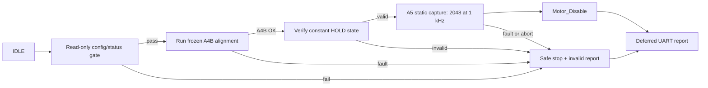

# Plan A5 — MA600 static RawAngle stability

Status: **A5.4 COMPLETE — A5.5 NOT STARTED**  
Parent control baseline: `CONTROL_A4B_ENCODER_SEEDED_DRAG_P35_OFFSET7971_V1`  
Approved profile: `CONTROL_A5_MA600_RAW_HOLD_P35_OFFSET7971_N2048_1KHZ_V1`

## 1. Decision and objective

A4B is now the frozen motion baseline:

- 20/20 physical runs returned `Result=OK` and passed the firmware/host
  contract;
- all required captures succeeded;
- no deadline, retry, transport, jump-reject or failed-sample event occurred;
- final electrical-offset range was 125 raw;
- the largest A4B static HOLD tail was 10 raw;
- the cold-start run also passed.

A5 measures exactly **one sensor output**: the 16-bit MA600 SPI angle word
returned by `MA600_ReadRawChecked()`. All other values in A5 are metadata or
statistics derived from that same sequence. A5 does not measure speed,
multi-turn, INL, correction-table performance, motor current or another motor.

The A5 question is:

> With the rotor aligned by the validated A4B trajectory, and with electrical
> phase and power held constant, how stable and repeatable is the MA600 angle
> word over time?

The angle word is the MA600 output after its configured internal processing.
With the current audited configuration (`ZERO=0`, `DIR=0`, `FILT=5`, zero
correction table), no application correction is added, but the sensor's FW=5
digital filter is still active. A5 must not call this an unfiltered analog
front-end angle.

## 2. Scope locks

### 2.1 Frozen A4B behavior

The following values remain compile-time locked and byte-for-byte equivalent
to A4B:

| Item | Locked value |
| --- | ---: |
| Electrical offset | 7971 raw |
| Target power | 350000 ppm (35%) |
| Power ramp | 300 ms |
| Full-cycle sweep reference | 2400 ms |
| Minimum sweep | 240 ms |
| A4B HOLD before A5 | 500 ms |
| Control period | 1 ms |
| Motion direction | forward only |
| Trajectory | existing quintic/S-curve |
| A4B max sample step | 150 raw |
| A4B max travel | 12000 raw |
| A4B capture and drag-slip gates | unchanged |

A5 must not change motor commutation, PWM frequency, phase trajectory,
capture detection, drag-slip logic, MA600 filter configuration, SPI prescaler,
DMA backend, retry behavior in A4B, or the A4B result calculation.

### 2.2 Explicit non-goals

- No FOC or PID retuning.
- No new motor homing behavior.
- No moving average, median or MAD applied to the stored official raw samples.
- No MA600 NVM/register writes.
- No calibration-table generation.
- No product or ISO pass/fail limit inferred from one pilot batch.
- No use of Motor ID as a validity gate; the operator may continue to record
  Motor ID manually.

## 3. Measurement contract

### 3.1 Window

| Field | A5 value |
| --- | ---: |
| Samples | 2048 accepted angle words |
| Nominal rate | 1000 Hz |
| Nominal interval | 1 ms |
| Nominal capture duration | 2.048 s |
| MA600 SPI frame | full 16-bit angle read |
| Transport | existing `SPI_DMA_BLOCKING_WRAPPER_V1` |
| Sensor filter | audited `FILT=0x05`, unchanged |
| Motor state | phase 0 equivalent, power 35%, output enabled |
| UART during capture | forbidden |

The first A5 sample is taken only after A4B has completed its existing 500 ms
HOLD. Thus A5 does not shorten the validated settle time. It adds a separate
static observation window while the last A4B field command remains active.

### 3.2 Why 2048 samples at 1 kHz

- It measures the actual 1 ms operating cadence already proven by A4B.
- A 2.048 s window separates short noise from slow drift better than the
  current approximately 60 ms HOLD-tail diagnostic.
- A power-of-two sample count simplifies offline spectral and Allan analysis.
- At 1 kHz the active read loop remains far inside the CPU budget: current
  A4B worst loop is about 3127 cycles (about 18.6 us at 168 MHz).
- The window is long enough for a first stability characterization without
  adding the heating of a 10–30 second powered hold.

A5 does not claim to characterize all noise up to the MA600 FW=5 cutoff. If
the 1 kHz result reveals aliasing or a PWM-phase dependency, a separately
versioned A5B rate/phase experiment will be designed; A5 itself stays frozen.

## 4. State machine and ownership



Only `ControlTask` owns the MA600 SPI interface while the engine is busy. No
idle diagnostic, second acquisition context or UART reporter may read the
sensor concurrently.

## 5. Firmware design

### 5.1 Constants

Proposed locked constants:

```c
#define CONTROL_A5_PROFILE_ID \
    "CONTROL_A5_MA600_RAW_HOLD_P35_OFFSET7971_N2048_1KHZ_V1"
#define CONTROL_A5_SAMPLE_COUNT              2048U
#define CONTROL_A5_PERIOD_MS                 1U
#define CONTROL_A5_CAPTURE_MS                2048U
#define CONTROL_A5_READ_ATTEMPTS             1U
#define CONTROL_A5_MAX_UNWRAP_JUMP_RAW       1821
#define CONTROL_A5_MAX_SAMPLE_STEP_RAW       150
#define CONTROL_A5_MAX_STATIC_TRAVEL_RAW     210
#define CONTROL_A5_MAX_CAPTURE_MS            2300U
```

`READ_ATTEMPTS=1` is intentional for this diagnostic: a retry changes the
sample timestamp and can hide a transport event. The acquisition fails
explicitly instead. This A5 policy does not change A4B's existing three-attempt
moving acquisition.

The unwrap threshold remains loose enough not to convert real rotor motion
into a false transport diagnosis. The separate 150-raw step and 210-raw total
static-travel gates classify an otherwise valid read as physical instability.

### 5.2 Dedicated acquisition context

A5 initializes a new `MA600_AcquisitionContext_t` immediately before the
static window. It must not inherit A4B's moving unwrap history or counters.

Every sample uses:

```c
MA600_AcquireSample(&a5Context,
    CONTROL_A5_MAX_UNWRAP_JUMP_RAW,
    CONTROL_A5_READ_ATTEMPTS,
    &sample);
```

The accepted raw word is never replaced by an average or robust estimator.

### 5.3 Evidence record

Proposed 12-byte record:

```c
typedef struct
{
    uint32_t csAssertCycle;
    uint16_t angleRaw;
    uint16_t pwmCounterAtCs;
    uint16_t spiLatencyCycles;
    uint8_t  attempts;
    uint8_t  flags;
} ControlA5Sample_t;

_Static_assert(sizeof(ControlA5Sample_t) == 12U,
    "A5 sample record size changed");
```

The array index is the sample index, so no sequence field is duplicated.
`csAssertCycle` is captured adjacent to `/CS`; unsigned subtraction handles
DWT wraparound. TIM1 phase is retained because the MA600 datasheet warns that
switching signals can affect resolution.

### 5.4 SRAM plan

Current Control image facts:

- A4 evidence uses 59,808 of 65,536 CCM bytes; A5 must not consume the small
  remaining CCM margin.
- Runtime `FreeHeap` is 91,688 bytes.
- Control task high-water evidence shows about 4544 stack bytes unused, but
  the A5 buffer must not be placed on the stack.

A5 buffer size:

```text
2048 samples × 12 bytes = 24,576 bytes
91,688 − 24,576 = 67,112 bytes nominal free heap remaining
```

Allocate this buffer once during `ControlEngine_Init()`, before any motor run,
and retain/reuse it for the lifetime of the A5 image. Do not allocate or free
memory inside the active capture. Initialization fails safely if the buffer
cannot be allocated. Log the actual free/min-ever-free heap after allocation.

### 5.5 Scheduling

- Reuse the A4B absolute `osDelayUntil()` pattern at 1 ms.
- Never issue catch-up samples back-to-back.
- Record the DWT `/CS` cycle for every accepted sample.
- A missed slot makes `TimingValid=0`; retain already captured evidence, then
  safe-stop.
- Continue allowing the default task to run between samples so a second
  button press can request operator abort.
- Do not use a two-second high-priority busy-wait that would prevent the
  button task from setting the abort flag.

### 5.6 Constant motor state

Immediately before and after the window, read `Motor_ControllerState_t` and
require:

- output enabled;
- output electrical phase equal to phase 0;
- output power equal to 0.35;
- commanded phase/power unchanged across the window.

The A5 loop must not call `Motor_SetElectricalPos()`. TIM1 continues producing
the already configured PWM in hardware. Any command-state change invalidates
the window.

### 5.7 Safe-stop ordering

All exits use exactly one path:

1. `Motor_Disable()`;
2. verify output is disabled/power zero;
3. optionally read final STATUS;
4. compute/finalize summaries;
5. write UART records.

No UART output is permitted before torque is removed, including errors and
operator abort.

## 6. Sensor configuration gate

Before A4B alignment, read the MA600 configuration without writing NVM. A5
requires and logs:

| Register/config | Expected |
| --- | ---: |
| ZERO | `0x0000` |
| DIR | `0x00` |
| FILT | `0x05` |
| STATUS | clean |
| PRT | `0x00` |
| RMAPID | `0x00` |
| Correction non-zero count | 0 |
| Correction CRC32 | `0x190A55AD` |

Sensor UID and manually entered Motor ID remain audit fields, not A5 numeric
validity inputs. A config mismatch aborts before motor enable and is not
silently corrected.

## 7. On-device statistics

All position statistics use the acquisition context's unwrapped angle relative
to sample 0, so a window crossing 65535/0 remains valid.

Firmware computes integer/fixed-point summaries only:

- first and last raw;
- minimum and maximum relative unwrapped raw;
- peak-to-peak raw;
- first-to-last drift raw;
- maximum absolute adjacent step;
- sum-relative-raw and mean-relative-raw Q16;
- minimum/maximum/mean SPI latency cycles;
- minimum/maximum sample interval cycles;
- maximum absolute schedule error cycles;
- PWM phase-bin coverage mask;
- CRC32 over the ordered 16-bit raw sequence;
- acquisition and timing counters.

Firmware does not use these descriptive statistics to alter raw samples.

## 8. Log schema

Use a new record prefix and `RecordVersion=1`.

### 8.1 Identity/config

```text
CONTROL_A5_ARMED,RecordVersion=1,Profile=...,ParentProfile=CONTROL_A4B_...,Metric=MA600_ANGLE_WORD_RAW16,SampleCount=2048,SampleRateHz=1000,CaptureMs=2048,CommandPhaseRaw=0,PowerPpm=350000,OffsetRaw=7971,Transport=SPI_DMA_BLOCKING_WRAPPER_V1,Filt=0x05
```

Also emit separate `CONTROL_A5_IDENTITY`, `CONTROL_A5_CLOCK` and read-only
configuration records. A missing or mismatched profile/config makes the host
contract fail. The separate records keep every UART line below the fixed
512-byte logger buffer and give the host the exact CPU/PWM timing constants.

### 8.2 Summary

```text
CONTROL_A5_SUMMARY,RecordVersion=1,Profile=...,Result=OK,MeasurementValid=1,InvalidReason=NONE,Accepted=2048,FirstRaw=...,LastRaw=...,MinRelRaw=...,MaxRelRaw=...,P2PRaw=...,DriftRaw=...,MaxAbsStepRaw=...,MeanRelRawQ16=...,RawCRC32=0x...
```

### 8.3 Timing/health/state

```text
CONTROL_A5_TIMING,RecordVersion=1,SlotsReached=2048,SkippedSlots=0,Overruns=0,IntervalMinCycles=...,IntervalMaxCycles=...,MaxAbsScheduleErrorCycles=...,SpiLatencyMinCycles=...,SpiLatencyMaxCycles=...,PwmPhaseBinMask=0x...
CONTROL_A5_HEALTH,RecordVersion=1,ReadAttempts=2048,Accepted=2048,Retries=0,TransportErrors=0,JumpRejects=0,FailedSamples=0
CONTROL_A5_STATE,RecordVersion=1,PreStateValid=1,PostStateValid=1,CommandChanged=0,SafeStopValid=1,...
CONTROL_A5_RUNTIME,RecordVersion=1,FreeHeapAfterAllocation=...,MinEverFreeHeap=...,ControlStackHighWaterWords=...
```

### 8.4 Raw evidence

After `Motor_Disable()` only:

```text
CONTROL_A5_DATA,RecordVersion=1,Profile=...,Index=0,Raw=...,CsAssertCycle=...,PwmCounterAtCs=...,SpiLatencyCycles=...,Attempts=1,Flags=0x00
```

There must be exactly 2048 unique contiguous indices for a valid run. The
host tool recomputes the CRC and all firmware summary fields from DATA.

## 9. Validity model

Keep data quality separate from product performance:

```text
MeasurementValid =
    ProfileValid
 && ConfigValid
 && A4BAlignmentValid
 && HoldCommandStateValid
 && AcquisitionValid
 && TimingValid
 && StaticWindowValid
 && RecordIntegrityValid
 && SafeStopValid
```

### 9.1 Hard structural gates

- Exact A5 profile and offset 7971.
- A4B alignment `Result=OK`.
- Exact 2048 accepted samples.
- Zero retry, transport error, jump reject and failed sample.
- Zero skipped slot and timing overrun.
- Constant phase/power state before and after capture.
- Maximum adjacent step no greater than 150 raw.
- Maximum displacement from sample 0 no greater than 210 raw.
- DATA indices contiguous and CRC valid.
- Motor disabled before reporting.

These gates decide whether the statistics are trustworthy. They do not claim
that a sensor meeting them satisfies a product or ISO accuracy requirement.

### 9.2 Pilot expectation bands — not firmware hard limits

Based on the A4B HOLD tails and MA600 FW=5 datasheet noise, the first A5 batch
is expected to be approximately within:

| Metric | Initial investigation band |
| --- | ---: |
| Within-window P2P | no more than 32 raw (0.176 deg mechanical) |
| Population standard deviation | no more than 5 raw (0.027 deg) |
| Absolute first-to-last drift | no more than 16 raw (0.088 deg) |
| Maximum adjacent step | no more than 16 raw for performance; 150 raw safety |
| Across-run mean range, same mount | no more than 125 raw (A4B baseline) |

Do not hard-code these statistical bands before the pilot data is reviewed.
If a band is exceeded while structural gates remain clean, classify the cause
instead of deleting/filtering samples.

## 10. Host analyzer

Add `scripts/analyze_control_a5.ps1` with wildcard input and optional CSV
export. It must:

1. split multiple physical runs in one text file;
2. validate identity, config, count, indices and CRC;
3. unwrap raw locally and reproduce firmware min/max/P2P/drift/mean;
4. compute population SD and RMS;
5. compute median, MAD and robust sigma as diagnostics only;
6. compute linear drift slope and detrended SD;
7. compute adjacent-delta histogram and maximum step;
8. compute autocorrelation and Allan deviation for 1, 2, 4, 8, 16, 32,
   64 and 128 ms;
9. bin raw residual by TIM1 PWM phase and report bin coverage/dependence;
10. report DWT interval jitter and SPI-latency distribution;
11. compare first/second runs, cold/warm runs and batch means;
12. export one summary row per physical run plus an optional raw-sample CSV.

PSD/Welch plots may be generated offline after the structural contract passes.
Spectral output is diagnostic and must not replace P2P/SD/drift values.

## 11. Implementation phases

### A5.0 — Freeze specification

- [x] Review and approve this plan (approved by the operator on 2026-07-20).
- [x] Confirm profile name, N=2048 and 1 kHz cadence.
- [x] Save the exact hardware-tested A4B ELF/HEX and hashes under
  `builds/control-a4b-offset7971-20260720/`.
- [x] Add `docs/control-a5-checklist.md` without changing firmware behavior.

Gate: no source behavior changes before the single-variable contract is
approved. **PASS on 2026-07-20.** The rollback HEX SHA-256 is
`858A17A1E22CCFAD6B92B0AA1A15533D25529D0611882E1F22728AF4CBF57186`.

### A5.1 — Data model and pure math

- [x] Add A5 constants, result enum, sample/report structures.
- [x] Add static assertions for record size and sample count.
- [x] Implement wrap-safe relative position, sum/Q16 mean and CRC.
- [x] Add deterministic tests for constant, quantized-noise, wraparound,
  linear drift, impulse and overflow vectors.
- [x] Add DWT wrap and schedule arithmetic tests.

Gate: pure tests pass without motor/HAL hardware. **PASS on 2026-07-20.**
`scripts/test_control_a5_math_contract.ps1`, the A4B alignment contract and
the dual-image isolation contract pass. The module compiles in Control Release
with zero warnings. It is not referenced by `control_engine.c`, contributes no
linked A5 symbol/string, and the resulting Control HEX remains byte-for-byte
identical to the frozen A4B hardware baseline (SHA-256
`858A17A1E22CCFAD6B92B0AA1A15533D25529D0611882E1F22728AF4CBF57186`).

### A5.2 — Capture integration

- [x] Allocate the 24,576-byte buffer once during engine initialization.
- [x] Add read-only MA600 config gate.
- [x] Call the frozen A4B alignment unchanged.
- [x] Verify constant HOLD state.
- [x] Capture 2048 samples with a dedicated context and no UART.
- [x] Enforce abort, timing, step/travel and safe-stop paths.
- [x] Verify every exit disables motor before reporting.

Gate: code review proves the A4B trajectory/constants are unchanged and the
A5 loop contains no motor-command mutation. **PASS on 2026-07-20.** A5.2 is
compiled and full-link audited behind a default-off activation lock; the
qualified A4B image remains active until the schema and new identity are
completed in A5.3/A5.4. The normal Control HEX remains identical to the frozen
hardware baseline.

### A5.3 — Schema and analyzer

- [x] Emit `CONTROL_A5_*` records after safe-stop.
- [x] Add host analyzer and synthetic fixtures.
- [x] Recompute CRC/summary from DATA and intentionally reject truncated,
  duplicated or reordered fixtures.
- [x] Preserve historical A4/A4B analyzer compatibility.

Gate: **PASS on 2026-07-20 for the software/schema boundary.** Firmware and
host summaries match exactly on constant and wraparound synthetic fixtures;
truncated, duplicate-index, reordered and bad-CRC fixtures are rejected. The
analyzer also splits multiple physical runs, exports summary/raw CSV and
computes SD/RMS, median/MAD, drift/detrended SD, delta histogram,
autocorrelation, Allan deviation, SPI timing and PWM-phase diagnostics. The
captured-hardware equality check remains an explicit A5.5 item because A5 is
still identity-locked and inactive until A5.4.

Evidence:

- `scripts/test_control_a5_reporting_contract.ps1`: PASS;
- `scripts/test_analyze_control_a5.ps1`: PASS;
- A5 enabled audit full link plus strict `-Werror -fanalyzer` compile: PASS
  (`text=58832`, `data=96`, `bss=175312`, before the retained 24 KiB heap
  buffer);
- A5.1/A5.2, A4B alignment, controller-state, SPI1 DMA, MAD and dual-image
  regression contracts: PASS;
- the historical A4B analyzer still accepts the complete stored batch 20/20;
- with A5 activation left at zero, the normal Control HEX remains identical
  to the frozen A4B image, SHA-256
  `858A17A1E22CCFAD6B92B0AA1A15533D25529D0611882E1F22728AF4CBF57186`.

### A5.4 — Build and isolation

- [x] Update app profile identity.
- [x] Update Control/Measurement dual-image contract.
- [x] Clean-build Control Debug/Release with zero warning.
- [x] Prove Measurement ELF does not contain A5 symbols/strings.
- [x] Record ELF/HEX hashes and memory map.
- [x] Confirm free heap remains above 64 KiB and stack headroom remains
  above 1 KiB via static config/self-guard/`-fstack-usage` evidence (runtime
  numbers deferred to A5.5 — no hardware run has been made with this image).

Gate: **PASS on 2026-07-20** for all host/contract/build/isolation checks.
Full evidence lives in `docs/control-a5-checklist.md` A5.4 section and
`builds/control-a5-offset7971-n2048-20260720/manifest.md`.

### A5.5 — Hardware pilot

- [ ] Same motor and mount; do not remove/reinstall.
- [ ] Five files, two physical runs per file (10 runs total).
- [ ] Cover all four electrical start quadrants.
- [ ] Include one first run after at least 15 minutes powered off.
- [ ] Record manifest/config from every independent boot.
- [ ] Run analyzer immediately after the batch.

Gate: 10/10 hard structural gates pass. Statistical bands are reviewed, not
silently promoted to product limits.

### A5.6 — Confirmation and lock

- [ ] Repeat one independent 10-run batch, including cold start.
- [ ] Compare within-run noise, between-run mean and cold/warm split.
- [ ] Freeze observed engineering limits only after 20 valid runs.
- [ ] Mark RawAngle stability as locked and stop measuring it in later phases,
  except for a small health summary.

Gate to leave A5: 20/20 structurally valid runs, no unexplained batch shift,
and documented limits with traceable raw evidence.

## 12. Failure decision tree

| Observation | Primary interpretation | Next action |
| --- | --- | --- |
| Retry/transport/jump/CRC failure | acquisition or record integrity | Fix A5 acquisition/logging; do not tune motor |
| Missed slot or timing tail | scheduler/interrupt contention | Profile IRQ/task timing; preserve raw math |
| High P2P, low drift, PWM-bin correlation | PWM/EMI sampling dependence | Separate A5B phase-synchronized/dithered sampling experiment |
| High P2P, low drift, no PWM correlation | sensor noise or physical vibration | Compare powered hold with a separately planned mechanically fixed motor-off test |
| Monotonic drift | thermal or mechanical creep | Add temperature/time evidence in a new profile; do not average it away |
| Discrete steps/bimodal distribution | rotor cogging/slip or mounting movement | Inspect A4B hold command and mechanics |
| Within-run stable, between-run mean moves | final equilibrium/offset repeatability | Treat as motor/control/mount variation, not intrinsic MA600 noise |
| Config differs | incomparable sensor state | Reject run; restore intended config only through an explicit separate procedure |

## 13. Rollback and change discipline

- Preserve the current A4B HEX and SHA-256 before coding.
- A5 gets a new profile identity; never relabel an A4B binary as A5.
- Implement one reviewable commit per A5.1–A5.4 phase.
- If A5 capture fails, flash the preserved A4B artifact; do not alter A4B
  offset or motion constants as a workaround.
- Hardware logs and generated CSV/plots remain evidence artifacts, not source
  code commits unless explicitly selected for a baseline package.

## 14. Final A5 deliverables

- A5 Control HEX/ELF plus hashes and build manifest.
- A5 contract tests and synthetic fixtures.
- `analyze_control_a5.ps1` and CSV schema.
- Two no-remount batches (20 physical runs), including independent cold starts.
- Raw sequence, timing, PWM-phase and health evidence for every run.
- A short A5 result document that states what is proven, observed limits,
  remaining unknowns and the exact gate for the next single MA600 parameter.
