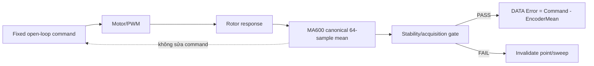
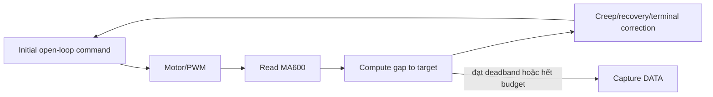

# Handoff tổng thể: hiệu chỉnh lại hướng đo Open-loop NL

**Ngày:** 2026-08-12  
**Trạng thái:** AUTHORITATIVE HANDOFF / DECISION RECORD  
**Đối tượng đọc:** agent tiếp theo, người review firmware, người phân tích log  
**Phạm vi:** định nghĩa phép đo NL, nguyên nhân dự án đi chệch hướng, trạng thái ALG-001/004/005, và kiến trúc V6.0 cần triển khai  

> Tài liệu này khóa lại mục tiêu hiện tại của dự án: **đo Open-loop NL thuần túy theo nguyên lý Gremsy**. Các nhánh V5.x có creep/terminal correction vẫn có giá trị chẩn đoán khả năng đáp ứng vị trí, nhưng không được dùng làm phép đo NL chính thức của motor.

> **RULE 0 — bắt buộc cho mọi thay đổi:** mọi thay đổi firmware, tool, schema,
> phân tích, build, quy trình test hoặc validation phải phục vụ trực tiếp việc
> đánh giá Open-loop NL, đồng thời phải khai báo ảnh hưởng của nó tới measurand.
> Thay đổi không phục vụ mục tiêu này nằm ngoài phạm vi, trừ khi người dùng cho
> phép rõ ràng một thí nghiệm `DIAGNOSTIC_ONLY`. Diagnostic có encoder sửa
> command phải đặt `OfficialOpenLoopNL=0`, `EligibleForStatistics=0` và không
> được gộp với thống kê Open-loop NL chính thức. Quy tắc thực thi đầy đủ nằm
> trong `AGENTS.md` ở root repository.

---

## 1. Kết luận điều hành

Project hiện tại **chưa đủ điều kiện phát hành một firmware NL chính thức theo định nghĩa Open-loop Gremsy**, dù đã đạt nhiều tiến bộ về acquisition, telemetry, unwrap, configuration gate và chẩn đoán chuyển động.

Nguyên nhân cốt lõi không phải `RampCommandToTarget()` đọc encoder ở từng micro-step. Phần này vẫn phát lệnh theo profile đã định trước và chỉ dùng encoder để quan sát/log.

Điểm đi chệch hướng thật nằm ở chuỗi **sweep-point creep / recovery / terminal correction**: encoder được đọc, sai số tới target được tính, rồi chính sai số đó quyết định lệnh điện tiếp theo trước khi lấy DATA. Khi đó phép đo không còn trả lời câu hỏi:

> Với một lệnh điện open-loop cố định, rotor thực tế lệch bao nhiêu?

Nó chuyển thành câu hỏi khác:

> Cần bao nhiêu lần hiệu chỉnh dựa trên encoder để đưa rotor gần target, và sau hiệu chỉnh còn lệch bao nhiêu?

Đây là phép đo **position-response có feedback correction**, hữu ích để phát triển jig và thuật toán chuyển động, nhưng không tương đương NL open-loop của Gremsy.

Hướng đúng cho V6.0 là tách thành hai hợp đồng firmware độc lập:

1. `GREMSY_COMPAT_OPEN_LOOP_NL_V1` — ứng viên đo chính thức.
2. `POSITION_RESPONSE_DIAGNOSTIC_V5X` — giữ creep/recovery/terminal correction để chẩn đoán, nhưng `EligibleForStatistics=0` đối với NL open-loop.

---

## 2. Mục tiêu đã được người dùng khóa

> **Cập nhật 2026-08-12 (cùng ngày, sau pilot run02 PASS)**: `AGENTS.md` giờ khóa **hai** mục tiêu
> theo thứ tự, không chỉ một — (1) đo Open-loop NL thuần túy (mục này), và (2) **đồng bộ NL giữa
> các jig** (cùng một motor, đo trên các jig khác nhau, phải cho ra NL open-loop tương đương —
> chính câu hỏi gốc JIG1-vs-JIG4 của dự án, vẫn CHƯA đóng, không tự động đóng chỉ vì đã có phép đo
> open-loop chạy tốt trên một jig). Cũng khóa rõ: **chưa có ngưỡng pass/fail sản phẩm nào được
> tính toán/calibrate** — không được suy ra hay hardcode ngưỡng từ một phiên đo bất kỳ.

Mục tiêu không phải FOC, closed-loop positioning hay ép mọi điểm rotor tới đúng command trước khi đo.

Mục tiêu là:

- kích motor bằng commutation open-loop giống nguyên lý Gremsy;
- quét đủ một vòng cơ khí trên một grid xác định;
- tại mỗi command, chờ hệ ổn định mà **không sửa command dựa trên encoder**;
- đọc MA600 nhiều mẫu và tính một mean duy nhất;
- tính sai lệch `Command - EncoderMean`;
- lấy độ dao động peak-to-peak của đường sai lệch làm NL tương thích Gremsy;
- nếu điểm không ổn định hoặc acquisition lỗi thì invalidate phép đo, không “cứu” điểm bằng feedback correction.

Phép đo này đánh giá **toàn hệ thống command-to-rotor**, gồm:

- đặc tính motor/cogging;
- ma sát và tải cơ khí;
- độ đồng đều từ trường và pha commutation;
- driver/PWM;
- mounting, sensor alignment và sai số MA600;
- sai số tracking open-loop.

Không có encoder tham chiếu độc lập nên firmware **không thể tách riêng sensor INL khỏi motor/jig**. Kết quả phải được gọi đúng là whole-system open-loop NL, không phải “INL tuyệt đối của riêng motor” hoặc “INL tuyệt đối của MA600”.

---

## 3. Công thức tham chiếu từ Gremsy

Code tham chiếu nằm tại:

- `datacty/gremsyTaskManager.c`
- `datacty/gremsyMotor.c`
- `datacty/gremsyEncoder.c`
- `datacty/gremsyProfiles_PM1505.h`

Trình tự cốt lõi trong `ST_STATE_NON_LINEAR_PROCESS`:

1. Giữ một command position.
2. Đọc nhiều mẫu encoder và tính trung bình.
3. Tính góc command từ raw command.
4. Tính error tại điểm.
5. Cập nhật max/min error.
6. Tăng command theo bước cố định.
7. Gọi `gremsyMotorMovePos(...)` với command mới.
8. Delay cố định trước điểm tiếp theo.

Công thức:

```text
CommandAngle[i] = 360 * CommandRaw[i] / FullScale

Error[i] = CommandAngle[i]
           - (EncoderMeanAngle[i] - EncoderAngleOffset)

NL_Gremsy = max(Error[i]) - min(Error[i])
```

Trong project hiện tại, đại lượng trực tiếp tương đương công thức cuối là:

```text
RawP2P = ErrorMax - ErrorMin
```

Các đại lượng `RMS_AC`, `RobustP2P`, harmonic `Hn/An`, đường error 360 điểm và residual là mở rộng hữu ích. Chúng không thay đổi định nghĩa gốc của `RawP2P`.

---

## 4. Phân biệt các khái niệm dễ bị nhầm

| Khái niệm | Encoder có được đọc? | Encoder có đổi command? | Phân loại |
| --- | ---: | ---: | --- |
| Open-loop không quan sát | Không bắt buộc | Không | Open-loop |
| Open-loop có telemetry | Có | Không | Vẫn open-loop |
| Stability gate | Có | Không; chỉ pass/fail | Vẫn open-loop nếu fail thì invalidate |
| Feedback correction / creep | Có | Có | Closed-loop correction |
| PID/FOC position control | Có | Có | Closed-loop control |

Điểm quan trọng:

> **Đọc encoder không tự động biến thuật toán thành closed-loop. Chỉ khi encoder tác động trở lại command thì mới có feedback actuation.**

Do đó, tên field `RampFeedbackEnabled=1` hiện tại gây hiểu nhầm. Ý nghĩa thực tế phù hợp hơn là:

```text
RampEncoderObservationEnabled=1
RampFeedbackActuationEnabled=0
```

đối với `RampCommandToTarget()` hiện tại.

---

## 5. Luồng hiện tại và điểm đi chệch hướng

### 5.1 Luồng mong muốn



### 5.2 Luồng V5.x tại điểm đo



Vòng `E -> G -> U -> C` chính là feedback actuation. Nó thay đổi measurand trước khi DATA được ghi.

### 5.3 Vị trí code cần phân biệt

#### `RampCommandToTarget()` — chưa phải nguyên nhân đi chệch

File: `Core/Src/nonlinear_test.c`, function `RampCommandToTarget()`.

Ở nhánh S-curve mặc định:

- command được tính từ profile quintic/S-curve;
- `Motor_SetElectricalPos()` phát command đó;
- MA600 được đọc ở từng micro-step;
- sample chỉ cập nhật telemetry/backtrack counters/step logs;
- sample không được dùng để thay đổi `pos` hoặc tái tính command profile.

Nhánh legacy cũng phát command định trước rồi đọc encoder để quan sát.

Vì vậy, finding cũ “ALG-005 ramp không có feedback” cần được diễn giải lại:

- **đúng** nếu “feedback” mang nghĩa encoder không sửa actuation;
- **sai** nếu kết luận ramp không đọc encoder hoặc không có observability;
- không phải defect cần “fix” để đạt open-loop NL;
- observability từng bước nên được giữ, vì giúp chứng minh rotor có/không bám command mà không làm đổi command.

#### `CreepToUnwrappedTargetProfiled()` — nguyên nhân scope drift thật

File: `Core/Src/nonlinear_test.c`, function `CreepToUnwrappedTargetProfiled()` và các nhánh recovery/terminal correction liên quan.

Luồng logic:

```text
gap = targetUnwrapped - observedEncoder
step = policy(gap, phase, budget, crossing, jump...)
commandPos += step
Motor_SetElectricalPos(commandPos)
read encoder again
repeat
```

Đây là vòng feedback correction hoàn chỉnh. Dù không dùng PID/FOC, nó vẫn là closed-loop theo định nghĩa điều khiển vì measurement ảnh hưởng trực tiếp tới actuation.

---

## 6. Vì sao dự án đi chệch hướng

Scope drift xảy ra theo một chuỗi quyết định hợp lý nếu xét từng bước riêng lẻ:

1. Rotor không tới đúng target open-loop tại một số điểm.
2. Hệ thống bổ sung settle gate để tránh đọc khi còn dao động — đây là cải tiến đúng.
3. Stable-but-off-target xuất hiện.
4. Creep được thêm để kéo rotor gần target.
5. Các điểm stick-slip/crossing vẫn fail nên thêm adaptive budget, fine landing, three-stage response, bounded recovery và terminal correction.
6. Thành công của motion được đánh giá bằng tỷ lệ vào deadband, endpoint error, response efficiency và số điểm recovered.

Sai lệch mục tiêu xảy ra ở bước 4: thay vì coi stable-but-off-target là **một phần của error open-loop cần đo**, hệ thống coi nó là lỗi cần sửa trước khi đo.

Kết quả là firmware ngày càng tốt hơn ở nhiệm vụ “đưa rotor tới target bằng encoder feedback”, nhưng ngày càng xa phép đo “quan sát rotor lệch bao nhiêu dưới command open-loop”.

Đây không phải công việc vô ích. V5.x đã tạo ra telemetry có giá trị cao để hiểu friction, breakaway, response gain, crossing và mounting. Sai ở đây là **gán nhánh chẩn đoán đó làm đường đo NL chính thức**.

---

## 7. Trạng thái ba finding đang được tranh luận

### 7.1 ALG-005 — trạng thái: INTERPRETATION CORRECTED

Claim lịch sử: ramp không có feedback.

Kết luận mới:

- `RampCommandToTarget()` có đọc MA600 ở mỗi micro-step.
- Các lần đọc này tạo observability/backtrack diagnostics.
- Encoder không thay đổi command S-curve.
- Ramp vẫn là open-loop actuation.
- Không cần thêm feedback actuation vào ramp cho firmware NL Gremsy-compatible.

Tài liệu cũ nói “không có lời gọi MA600 trong ramp” là stale và phải được sửa ở lượt documentation cleanup.

### 7.2 ALG-001 — trạng thái: CONFIRMED, IMPACT REFINED

Trong capture per-point hiện tại:

1. 64 transaction SPI được đọc và average thành `encAngle`.
2. `error` chính thức được tính từ `encAngle`.
3. Sau đó firmware đọc transaction thứ 65 riêng.
4. `rawAtPoint`, `rawAtMax/rawAtMin`, `absoluteAngleAtMax/Min` và một số DATA trace dùng mẫu thứ 65.

Ảnh hưởng đúng:

- `errorSamples[]`, `RMS_AC`, `RawP2P`, `RobustP2P` và harmonic tính từ 64-sample mean không bị đổi bởi transaction 65;
- nhưng raw/absolute location gắn với extrema không còn cùng một nguồn đo với error đã tạo extrema;
- DATA trace và result summary có thể mô tả hai thời điểm khác nhau dưới cùng một Point;
- đây là lỗi traceability/single-source-of-truth, không phải bằng chứng rằng toàn bộ NL scalar đã bị transaction 65 làm sai.

Không nên sửa bằng cách lấy “mẫu thứ 64” làm `rawAtPoint`, vì một mẫu đơn vẫn không đại diện cho mean 64 mẫu.

Cách sửa đúng:

- canonical sampler trả ra `MeanUnwrappedRawQ16` từ chính 64 accepted samples;
- mọi error, DATA, extrema location và derived degrees dùng cùng canonical mean đó;
- nếu muốn giữ single raw diagnostic thì phải đặt tên rõ `DiagnosticLastRaw` và không dùng nó làm state chính thức.

### 7.3 ALG-004 — trạng thái: CONFIRMED ARCHITECTURE DEBT

Firmware hiện hardcode:

```text
OfficialResultSource=LEGACY
ShadowOfficial=0
```

Canonical Q16 vẫn là shadow. Hệ quả:

- hai pipeline cùng tồn tại;
- dễ có divergence giữa DATA/result/tool;
- contract ID và point-count từng bị dùng không nhất quán;
- khó xác định một source of truth duy nhất cho phép đo chính thức.

ALG-004 cần được xử lý ở schema V6, nhưng phải cutover canonical vào **open-loop measurement profile**, không phải hợp thức hóa creep-corrected measurement thành official.

---

## 8. Những phần V5.x vẫn có giá trị

Không loại bỏ kiến thức hoặc telemetry V5.x. Các phần sau vẫn nên giữ trong diagnostic profile:

- encoder observation ở mỗi ramp micro-step;
- command raw và observed raw;
- encoder net travel và total travel;
- backtrack/opposite-response counters;
- phase response efficiency;
- creep gap, iteration, budget, crossing và jump telemetry;
- terminal correction result;
- home response timing/overshoot diagnostics;
- per-point stability and acquisition quality;
- full 360-point error curve, harmonic decomposition và cross-remount comparison.

Nhưng các result từ profile này phải được gắn rõ:

```text
MeasurementProfile=POSITION_RESPONSE_DIAGNOSTIC_V5X
MeasurementDefinition=ENCODER_CORRECTED_POSITION_RESPONSE
OfficialOpenLoopNL=0
EligibleForStatistics=0
```

Không được trộn chúng với batch open-loop khi tính repeatability, product signature hoặc giới hạn chất lượng NL.

---

## 9. Bằng chứng 7 pole-pair (PG07) và cách diễn giải đúng

Các log V5.8 PG07 trong repository 7PP cho thấy:

- geometry 14 pole/7 pair và harmonic order 42 được cấu hình đúng;
- acquisition sạch;
- đường error giữa hai remount tương quan rất cao, khoảng `r ~= 0.997` với shift 0;
- chỉ khoảng 51–60% điểm đạt target gate;
- 147 điểm fail cả 4 sweep, 159 điểm fail ít nhất 3/4;
- nominal command bước 1° gần đúng, nhưng creep response efficiency chỉ khoảng 75–78%;
- low-order `H2/H6` lớn hơn `H42`, nên sai lệch không chỉ là harmonic điện 42.

Kết luận hợp lệ:

- hiện tượng là có cấu trúc và lặp lại, không phải acquisition noise ngẫu nhiên;
- profile V5.8 không đủ phù hợp với response của motor 7PP;
- motion/fixture/magnetic interaction có đóng góp lớn.

Kết luận **không** được phép rút ra:

- không thể dùng V5.8 feedback-corrected batch để kết luận NL open-loop chính thức của PG07;
- không thể coi tỷ lệ đạt target là số điểm NL “đúng”;
- không thể retune creep rồi tuyên bố motor có NL tốt hơn, vì chính measurand đã thay đổi.

Tài liệu bằng chứng chi tiết:

- `D:/tanpham/QAtoool/jigtest/motor/1807/jigmotor/docs/session-summary-2026-08-11.md`

---

## 10. Kiến trúc V6.0 được đề xuất

### 10.1 Hai profile tách biệt

#### Profile A — official candidate

```text
MeasurementProfile=GREMSY_COMPAT_OPEN_LOOP_NL_V1
MeasurementDefinition=WHOLE_SYSTEM_OPEN_LOOP_TRACKING_V1
OfficialResultSource=CANONICAL_Q16
FeedbackActuationEnabled=0
```

Quy tắc bất biến:

- command grid cố định trước batch;
- motion profile cố định, không phụ thuộc encoder response;
- encoder observation được phép;
- stability/acquisition gate được phép;
- không creep;
- không endpoint feedforward học từ response;
- không adaptive budget dựa trên gap;
- không bounded recovery;
- không terminal correction;
- không PID/FOC position correction trước DATA;
- không đổi command sau khi ramp kết thúc và trước/during canonical capture;
- fail gate thì invalidate, không rescue.

#### Profile B — diagnostics only

```text
MeasurementProfile=POSITION_RESPONSE_DIAGNOSTIC_V5X
MeasurementDefinition=ENCODER_CORRECTED_POSITION_RESPONSE
OfficialOpenLoopNL=0
EligibleForStatistics=0
```

Profile này được phép dùng creep/recovery/terminal correction và giữ toàn bộ telemetry V5.x.

### 10.2 Canonical point sampler duy nhất

Mỗi point official cần trả một record canonical:

```text
PointIndex
CommandRawQ16
MeanUnwrappedRawQ16
AcceptedSampleCount
TransactionCount
SpiFailureCount
JumpRejectedCount
StabilityValid
AcquisitionValid
ErrorRawQ16
ErrorDeg
```

Công thức:

```text
ReferenceRawQ16 = MeanUnwrappedRawQ16[0]

RelativeEncoderRawQ16[i] =
    MeanUnwrappedRawQ16[i] - ReferenceRawQ16

ErrorRawQ16[i] =
    CommandRelativeRawQ16[i] - RelativeEncoderRawQ16[i]

ErrorDeg[i] = ErrorRawQ16[i] * 360 / (65536 * 65536)

RawP2P = max(ErrorDeg[i]) - min(ErrorDeg[i])
```

Mọi metric official phải derive từ cùng `ErrorRawQ16[]`:

- RawP2P / Gremsy-compatible NL;
- RMS_AC;
- RobustP2P;
- mean/DC diagnostic;
- harmonics `Hn/An`;
- closure;
- full 360-point curve.

### 10.3 Settle đúng nghĩa cho open-loop

Settle chỉ được phép đánh giá **ổn định**, không đánh giá rotor đã tới command để rồi sửa command.

Ví dụ hợp lệ:

- encoder P2P trong cửa sổ dưới ngưỡng;
- standard deviation dưới ngưỡng;
- max step dưới ngưỡng;
- đủ N lần liên tiếp;
- timeout => point/sweep invalid.

`TargetProximityValid` có thể được log như diagnostic tracking integrity, nhưng nếu nó được dùng để điều khiển motor tới gần target thì profile không còn open-loop. Chính sách invalidate do gross tracking phải được version hóa riêng và không được silently correct.

---

## 11. Lộ trình triển khai khuyến nghị

### S0 — Sửa contract và tài liệu trước code

- khóa hai MeasurementProfile nói trên;
- sửa định nghĩa schema V6 từ `WHOLE_SYSTEM_COMMAND_TRACKING` sang tên versioned thể hiện open-loop;
- sửa các câu stale về ALG-005;
- đánh dấu V5.x roadmap là response diagnostic, không phải official NL roadmap;
- đặt một contract ID mới cho capture 360-point, không tái sử dụng ID 256-point.

### S1 — Tạo compile-time/runtime isolation

- thêm selector profile rõ ràng;
- official build compile-out hoặc hard-disable mọi creep/recovery/terminal correction;
- log `FeedbackActuationEnabled=0`;
- static test fail build nếu official profile gọi các hàm correction.

### S2 — Cutover canonical sampler

- gom 64 accepted samples thành một mean Q16;
- bỏ dual-source official/65th-read association;
- DATA, extrema, curve và RESULT cùng dùng canonical mean;
- giữ single raw chỉ dưới tên diagnostic nếu thật sự cần.

### S3 — Xây đường đo Open-loop Gremsy-compatible

- fixed command S-curve/ramp;
- stability-only gate;
- canonical capture;
- error và RawP2P từ một source of truth;
- giữ encoder ramp telemetry ở chế độ observation-only.

### S4 — Verification phần mềm

- compile các profile độc lập;
- unit/contract tests;
- parser compatibility v4/v5/v6;
- analyzer lấy point count động;
- reject PRECONDITION và `EligibleForStatistics=0` khỏi official summary;
- graph/schema fixtures cho valid/invalid V6.

### S5 — Pilot phần cứng

Thứ tự khuyến nghị:

1. Một motor quen thuộc, một jig ổn định, không tháo lắp: A/B/A giữa legacy Gremsy-like và V6 open-loop canonical.
2. Lặp lại sau remount có torque kiểm soát.
3. Cross-jig cùng motor.
4. Sau khi pipeline ổn định mới thử PG07/7PP.

Không dùng scalar NL một mình để promote. Phải kiểm tra:

- full curve correlation/shift;
- RawP2P;
- RMS_AC/RobustP2P;
- extrema angle/family;
- harmonic spectrum;
- stability/acquisition validity;
- thermal/precondition state;
- repeatability within-mount và between-remount.

### S6 — Qualification

- Gage R&R;
- mounting torque/orientation procedure;
- cross-jig reproducibility;
- reference encoder/rotary stage nếu cần tuyên bố absolute sensor/motor INL;
- freeze firmware, schema, analyzer và product limits cùng một version.

---

## 12. Acceptance criteria tối thiểu cho V6.0

### 12.1 Static/code gates

- official profile không gọi `CreepToUnwrappedTargetProfiled()`;
- official profile không gọi bounded recovery/terminal correction;
- command không đổi từ ramp-end qua settle/capture của cùng point;
- MA600 ramp reads không tác động command;
- mỗi point có đúng một canonical mean official;
- không dùng transaction thứ 65 làm official DATA association;
- mọi metric derive từ canonical error array;
- `OfficialResultSource=CANONICAL_Q16` chỉ xuất hiện khi contract thật sự được thực thi;
- `EligibleForStatistics` và `RunRole` được analyzer gate đúng;
- point count/closure index lấy từ META, không hardcode 256.

### 12.2 Runtime gates

- config gate pass;
- acquisition clean theo budget;
- zero context reacquisition hoặc theo contract đã khóa;
- đủ 360 analysis points và closure point theo schema;
- point stability pass; timeout làm invalid;
- gross tracking guard chỉ invalidate, không correction;
- precondition không lọt vào official statistics.

### 12.3 Measurement gates

- within-mount repeatability được báo bằng curve và scalar;
- remount sensitivity được báo riêng;
- cross-jig delta không được “sửa” bằng offset scalar nếu curve shape khác;
- kết quả V5.x không được trộn vào V6 official batch;
- không tuyên bố motor-only NL nếu chưa có reference độc lập.

---

## 13. Tài liệu nào đang stale hoặc cần rebase

| Tài liệu | Trạng thái sau quyết định này |
| --- | --- |
| `docs/nonlinear_algorithm_audit.md` | Giữ phần audit; ALG-005 cần correction note; impact ALG-001 cần thu hẹp đúng như mục 7.2 |
| `docs/system_measurement_architecture.md` | Câu nói ramp không đọc MA600 là stale |
| `docs/nonlinear-log-schema-v6.md` | Vẫn là draft; cần đổi/version `MeasurementDefinition` cho open-loop và chỉ promote sau implementation |
| `docs/nonlinear-methodology-change-rationale-and-status.md` | Tài liệu lịch sử; point count/phase status không phản ánh toàn bộ firmware hiện tại |
| `docs/nl-jig-production-readiness-roadmap-2026-08-11.md` | Cần rebase: closed-loop/V5.9 là readiness của response diagnostic, không phải điều kiện của open-loop NL official |
| Các plan V5.1–V5.9 | Giữ làm lịch sử phát triển/chẩn đoán motion; không dùng làm định nghĩa official NL |
| `docs/nonlinear-log-schema-v6.md` + analyzer tools | Phải được version-lock cùng firmware V6 trước production |

Tài liệu này chỉ supersede các diễn giải được ghi rõ trong bảng. Nó không tự động vô hiệu mọi số liệu hoặc finding lịch sử khác.

---

## 14. Những việc agent tiếp theo không được làm

- Không thêm PID/FOC/creep vào official NL chỉ vì một điểm off-target.
- Không gọi observation-only ramp là closed-loop.
- Không coi “đạt target nhiều hơn” đồng nghĩa “NL chính xác hơn”.
- Không tối ưu RawP2P bằng cách dùng chính encoder để kéo rotor tới target trước capture.
- Không dùng mẫu SPI thứ 64 hoặc 65 thay cho canonical mean 64 mẫu.
- Không promote schema V6 bằng cách chỉ đổi chuỗi log.
- Không gộp PRECONDITION, diagnostic V5.x và official open-loop vào cùng statistics.
- Không so sánh cross-jig chỉ bằng một scalar NL và bỏ qua full curve/extrema/harmonics.
- Không tuyên bố sensor hoặc motor là nguyên nhân duy nhất khi chưa có reference encoder độc lập.
- Không tiếp tục V5.9/V6 closed-loop tuning nếu nhiệm vụ hiện tại là official open-loop NL.

---

## 15. File map cho agent tiếp theo

### Code chính

- `Core/Src/nonlinear_test.c`
  - `RampCommandToTarget()` — open-loop command + encoder observation.
  - `CreepToUnwrappedTargetProfiled()` — feedback actuation cần loại khỏi official profile.
  - capture per-point — nơi đang tồn tại 64-sample mean + transaction thứ 65.
  - META/RESULT — nơi còn `OfficialResultSource=LEGACY`, `ShadowOfficial=0`.
- `Core/Src/ma600.c`
- `Core/Src/ma600_acquisition.c`
- `Core/Src/motor_pwm.c`
- `Core/Src/position_controller.c`

### Gremsy reference

- `datacty/gremsyTaskManager.c`
- `datacty/gremsyMotor.c`
- `datacty/gremsyEncoder.c`
- `datacty/gremsyProfiles_PM1505.h`

### Contract/audit

- `docs/nonlinear_algorithm_audit.md`
- `docs/nonlinear-log-schema-v6.md`
- `docs/nonlinear-methodology-change-rationale-and-status.md`
- `docs/system_measurement_architecture.md`
- `docs/nl-jig-production-readiness-roadmap-2026-08-11.md`

### Evidence 7PP

- `D:/tanpham/QAtoool/jigtest/motor/1807/jigmotor/docs/session-summary-2026-08-11.md`

---

## 16. Checklist khởi động cho agent tiếp theo

- [ ] Đọc tài liệu này trước các plan V5.x.
- [ ] Xác nhận với người dùng mục tiêu vẫn là `GREMSY_COMPAT_OPEN_LOOP_NL_V1`.
- [ ] Audit call graph từ per-point sweep tới creep/recovery/capture.
- [ ] Viết correction note cho ALG-005 và ALG-001.
- [ ] Version lại MeasurementDefinition và MathContract cho 360-point open-loop.
- [ ] Thiết kế profile isolation trước khi sửa thuật toán.
- [ ] Refactor canonical 64-sample Q16 source-of-truth.
- [ ] Tạo static tests chứng minh feedback actuation bị tắt trong official profile.
- [ ] Build/test/package riêng profile official và diagnostic.
- [ ] Chỉ sau đó yêu cầu hardware pilot A/B/A.

---

## 17. Quyết định cuối cùng

Project không thất bại; nó đã giải được một bài toán khác rất tốt: **đo và cải thiện khả năng đưa rotor tới target bằng encoder-assisted correction**.

Để đạt mục tiêu người dùng vừa khóa, cần quay lại đúng measurand:

```text
Fixed open-loop command
-> observe rotor response
-> stability-only validation
-> one canonical 64-sample mean
-> Error curve over 360 degrees
-> RawP2P / RMS / robust / harmonics
```

Không sửa response trước khi đo. Nếu response không ổn định hoặc tracking quá kém, phép đo phải bị đánh dấu invalid; chính sai lệch ổn định còn lại là dữ liệu mà Open-loop NL cần quan sát.

---

## 18. Compliance check — mục 12 đối chiếu trực tiếp với code hiện tại (2026-08-12, sau khi handoff này được viết)

Xác nhận từng gate ở mục 12.1/12.2 bằng cách đọc trực tiếp `Core/Src/nonlinear_test.c` tại thời điểm này (không suy diễn). Không kiểm tra được từ code tĩnh thì ghi rõ UNKNOWN, không đoán.

### 18.1 Static/code gates (mục 12.1)

| Gate | Kết quả | Bằng chứng |
| --- | --- | --- |
| Official profile không gọi `CreepToUnwrappedTargetProfiled()` | **FAIL — chưa có profile isolation** | Không tồn tại khái niệm "official profile" tách biệt trong code. Mọi nhánh creep/recovery/terminal nằm sau CÙNG một master flag `ENABLE_SWEEP_POINT_CREEP` (dòng 902); không có static assert/compile guard nào cấm gọi creep trong một build tự xưng "official". |
| Official profile không gọi bounded recovery/terminal correction | **FAIL — cùng lý do trên** | — |
| Command không đổi từ ramp-end qua settle/capture của cùng point | **PASS khi `ENABLE_SWEEP_POINT_CREEP=0`** | `WaitForPointSettle()` (dòng 3013-3082+) chỉ gọi `MA600_AcquireSample()`, không có `Motor_SetElectricalPos()` nào trong hàm. Khi creep tắt, code đi thẳng từ settle sang vòng average 64-mẫu, không có bước nào sửa `pos` ở giữa. |
| MA600 ramp reads không tác động command | **PASS, xác nhận cả 2 nhánh** | `RampCommandToTarget()` dòng 2632-2743: nhánh `NL_MOTION_PROFILE_SCURVE_V2` (đang là default, dòng 78) dòng 2669-2679, và nhánh legacy dòng 2713-2727 — `rampSample`/`r` chỉ ghi vào `motionDiag`/`stepUnwrappedRawLog`, không bao giờ gán lại `*pos`. |
| Mỗi point có đúng một canonical mean official | **FAIL — ALG-001 xác nhận còn nguyên** | `encAngle` (dòng 5718, trung bình 64 mẫu) dùng cho `error` (dòng 5725); `rawAtPoint` (dòng 5739, transaction thứ 65 riêng) dùng cho `DATA.AngleRaw`/`rawAtMax`/`rawAtMin`/`absoluteAngleAtMax/Min`. Hai nguồn khác nhau trên cùng một Point. |
| Không dùng transaction thứ 65 làm official DATA association | **FAIL — xác nhận** | Chính là hành vi ở dòng 5733-5773 nêu trên. |
| Mọi metric official derive từ canonical error array | **PARTIAL** | `RawP2P`/`RMS_AC`/`RobustP2P`/harmonic: PASS, derive từ `errorSamples[]` (64-mean based). `rawAtMax/rawAtMin`/absolute-angle-tại-cực-trị: FAIL, derive từ transaction 65. |
| `OfficialResultSource=CANONICAL_Q16` chỉ xuất hiện khi contract thật sự thực thi | **Vacuously true, nhưng ALG-004 vẫn mở** | Dòng 7197-7198: `OfficialResultSource=LEGACY` là chuỗi literal hardcode, không có nhánh nào phát `CANONICAL_Q16` — nên gate này chưa từng bị vi phạm theo nghĩa đen, nhưng cũng có nghĩa canonical KHÔNG BAO GIỜ là official, đúng ALG-004. |
| `EligibleForStatistics`/`RunRole` được analyzer gate đúng | **PASS (đã sửa 2026-07-30)** | `tools/analyze_motor_logs.py` yêu cầu `RunRole=OFFICIAL && EligibleForStatistics=1`, loại PRECONDITION dù acquisition/END valid (theo `CODEX_HANDOFF_NL_JIG_SYNC_2026-07-30.md` mục 4.2). |
| Point count/closure index lấy từ META, không hardcode 256 | **PASS (đã sửa 2026-07-30)** | Cùng nguồn trên: `AnalysisPoints` từ META, closure index = `AnalysisPoints`, `StepRaw=0` = rounded 1-degree grid. |

### 18.2 Phát hiện mới — không có trong bản handoff gốc: `EligibleForStatistics` KHÔNG bị chặn bởi creep/terminal correction tự thân

Đọc trực tiếp dòng 9478-9493:

```c
nlCaptures[i].eligibleForStatistics = !preconditionRun
    && preconditionValid
    && (nlCaptures[i].sweepPointCreepRecoveryFailedCount == 0U)
    && (nlCaptures[i].sweepPointCreepStickSlipJumpCount == 0U)
#if ENABLE_SWEEP_POINT_CREEP_V57_HARDCAP_HOLD_DIAG \
        || ENABLE_SWEEP_POINT_RESPONSE_TIMING_DIAG
        && false
#endif
    ;
```

`&& false` **chỉ được compile vào khi V5.7 hoặc V5.8 bật** — không có nhánh nào tương ứng với `ENABLE_SWEEP_POINT_CREEP_V59_EXTENDED_TERMINAL_CORRECTION` hay với chính `ENABLE_SWEEP_POINT_CREEP`/V5.4/V5.5 (creep cơ bản). Hệ quả cụ thể:

- Artifact `sweep-point-terminal-correction-v5-9a-fast3-20260812` (đã đóng gói trong phiên này) có V5.8 bật → `EligibleForStatistics=0` mọi run, đúng như đã xác nhận trước đó trong phiên.
- Nhưng **`V5.9b`** — production candidate mà chính handoff mục 12.2 gợi ý ("timing OFF") — nếu build với V5.4+V5.5+V5.9 bật và V5.8 **tắt**, sẽ có `EligibleForStatistics=1` cho mọi point đã đi qua terminal correction thành công, miễn là không recovery-fail/stick-slip. Không có gì trong code hiện tại ngăn dữ liệu creep-corrected của build này lọt vào official statistics.

Đây là vi phạm trực tiếp mục 14 ("Không gộp... diagnostic V5.x và official open-loop vào cùng statistics") mà **chính bản đóng gói V5.9b được đề xuất trong handoff này sẽ mắc phải nếu triển khai đúng như mô tả ở mục 12.2**, trừ khi thêm rõ:

```c
#if ENABLE_SWEEP_POINT_CREEP_V57_HARDCAP_HOLD_DIAG \
        || ENABLE_SWEEP_POINT_RESPONSE_TIMING_DIAG \
        || ENABLE_SWEEP_POINT_CREEP
        && false
#endif
```

(hoặc gate theo `MeasurementProfile` một khi S1 — profile isolation — được triển khai, thay vì liệt kê từng flag riêng lẻ như hiện tại).

### 18.3 Runtime/measurement gates (mục 12.2/12.3)

Không kiểm được từ code tĩnh — cần log/hardware để xác nhận, liệt kê để không bỏ sót khi làm S4/S5:

- Config gate pass, acquisition clean theo budget, zero context reacquisition: cần chạy lại trên build official profile (chưa tồn tại).
- Within-mount repeatability / remount sensitivity / cross-jig delta theo curve shape: cần dữ liệu từ đúng `GREMSY_COMPAT_OPEN_LOOP_NL_V1` (chưa build).
- Không tuyên bố motor-only NL nếu chưa có reference độc lập: vẫn đúng, không đổi.

### 18.4 Kết luận compliance

Code hiện tại **CHƯA đạt** `GREMSY_COMPAT_OPEN_LOOP_NL_V1` theo đúng 12.1: 4/10 gate FAIL, 1/10 PARTIAL, 1/10 chỉ đúng-do-chưa-làm (ALG-004), 4/10 PASS. Quan trọng nhất trong số FAIL là thiếu profile isolation (S1) — nếu không có nó, mọi gate PASS khác (ramp observation-only, settle không sửa command) chỉ đúng "khi cấu hình flag đúng bằng tay", không được code TĨNH đảm bảo — đúng nguyên nhân khiến `V5.9b` (chưa build) có nguy cơ âm thầm vi phạm mục 14 như 18.2 đã chỉ ra.

### 18.5 Cập nhật 2026-08-12 (cùng ngày, sau review) — S1 xong, ALG-001 đã sửa

S1 (profile isolation) đã triển khai và verify bằng compile thật (cả 2 chiều: bật creep dưới profile
open-loop → `#error`; chuyển sang diagnostic profile → compile sạch), không chỉ đọc code tĩnh:

- `NL_MEASUREMENT_PROFILE` (`NL_PROFILE_GREMSY_OPEN_LOOP` mặc định) + `#error` guard chặn
  `ENABLE_SWEEP_POINT_CREEP`/`ENABLE_B0B_APPROACH_CREEP`/`ENABLE_SWEEP_POINT_CREEP_V59_...` khi
  profile=open-loop.
- `eligibleForStatistics` viết lại profile-gated (`(NL_MEASUREMENT_PROFILE == NL_PROFILE_GREMSY_OPEN_LOOP) && !preconditionRun && preconditionValid && nlCaptures[i].measurementValid`) — đóng đúng
  lỗ hổng nêu ở 18.2. Phát hiện phụ: công thức cũ chưa từng check `measurementValid` — đã sửa kèm.
- `MeasurementProfile`/`OfficialOpenLoopNL`/`RampEncoderObservationEnabled`/`RampFeedbackActuationEnabled`
  telemetry mới; `RampFeedbackEnabled=1` (tên cũ gây hiểu nhầm) đã retired.
- `scripts/test_open_loop_nl_profile_isolation_contract.ps1` mới, đã negative-test.

**ALG-001 đã sửa** (không chỉ interpretation-corrected như ALG-005 — sửa thật):
`CaptureSweep()` giờ tích lũy `unwrappedRawSum` (int64) song song với `angleSampleSum` trong CÙNG vòng
lặp 64 mẫu, tính `meanUnwrappedRaw` (round-to-nearest away-from-zero, khớp `SignedRoundingMode`
đã khóa ở schema v6), rồi derive `rawAtPoint` bằng modulo 65536 — không còn transaction thứ 65 nào cả
(loại bỏ hẳn, không chỉ đổi nguồn). `DATA.AngleRaw`/`rawAtMax`/`rawAtMin`/`absoluteAngleAtMax/Min` giờ
luôn truy ngược được về đúng cửa sổ 64-mẫu đã tạo ra `Error` đó. Side effect tích cực: giảm 1 SPI
transaction/point. Verify: compile sạch cả open-loop (không creep) lẫn diagnostic (V5.4+V5.5+V5.8+V5.9
cùng bật), CCM headroom không đổi (0xD088, ~11.9KB), negative-test xác nhận contract script bắt được
khi cố tình phá dòng `rawAtPoint`.

**ALG-004 CHƯA sửa, có chủ đích** — không flip `OfficialResultSource` sang `CANONICAL_Q16` hôm nay.
Lý do: mục 14 của chính handoff này cấm rõ "Không promote schema V6 bằng cách chỉ đổi chuỗi log". Việc
ALG-001 vừa xong giải quyết đúng phần "một canonical mean per point" mà S2 cần — nhưng cutover
`OfficialResultSource` thật đòi hỏi toàn bộ S3 (dựng đường đo Gremsy-compatible với canonical capture
end-to-end) + S4 (verify phần mềm) + S5 (pilot hardware A/B/A) trước khi promote, đúng theo lộ trình đã
khóa ở mục 11. Trạng thái: `OfficialResultSource=LEGACY` vẫn đúng và có chủ đích cho tới khi S3-S5 xong,
không phải nợ kỹ thuật bị bỏ quên.

Cập nhật bảng 18.1: "Mỗi point có đúng một canonical mean official" và "Không dùng transaction thứ 65
làm official DATA association" chuyển từ FAIL → **PASS**. "Official profile không gọi
`CreepToUnwrappedTargetProfiled()`"/"...bounded recovery/terminal correction" chuyển từ FAIL → **PASS**
(được `#error` guard đảm bảo tĩnh, không còn phụ thuộc cấu hình tay). Còn lại FAIL/PARTIAL: chỉ
`OfficialResultSource=CANONICAL_Q16` (ALG-004, có chủ đích chưa làm) và "Mọi metric official derive từ
canonical error array" nay đã PASS toàn bộ (extrema cũng dùng canonical mean). Compliance hiện tại:
8/10 PASS, 1/10 đúng-do-chưa-làm (ALG-004, có chủ đích), 1/10 cần S3-S5 hardware để verify runtime.

### 18.6 Cập nhật 2026-08-12 (review độc lập lần 2) — sửa lỗ hổng guard, xác nhận các finding còn lại

Review độc lập tiếp theo phát hiện `ENABLE_B0B_APPROACH_FEEDFORWARD` KHÔNG có trong guard mục 18.5 —
đã xác nhận đúng và sửa:

- `ExtendCommandBlind()` không đọc MA600 trong lúc chạy (đúng), nhưng bias hằng số nó dùng
  (`NL_B0B_FEEDFORWARD_BACKOFF_BIAS_RAW`/`FORWARD_BIAS_RAW`) có `NL_B0B_FEEDFORWARD_PROTOCOL_ID =
  "CREEP_DERIVED_BIAS_V2"` — tự đặt tên xác nhận nó được "learned" từ dữ liệu creep/encoder trước đó,
  đúng loại RULE 0 cấm ("feedforward learned from the same encoder response"), dù cơ chế thực thi
  không đọc encoder tại thời điểm chạy.
- Guard gốc đặt SAI VỊ TRÍ: ở dòng ngay sau cascade V5.x (~1093 cũ), TRƯỚC khi
  `ENABLE_B0B_APPROACH_FEEDFORWARD` được `#define` (ở dòng ~1409 cũ) — macro chưa định nghĩa trong
  `#if` được coi là `0` theo chuẩn C nên KHÔNG gây lỗi build, nhưng im lặng ngừng bảo vệ nếu thứ tự
  định nghĩa flag bị đảo sau này. Đã chuyển toàn bộ guard xuống sau khi
  `ENABLE_B0B_APPROACH_FEEDFORWARD` được định nghĩa đầy đủ, và thêm flag này vào điều kiện `#error`.
- Verify: compile sạch mặc định; bật `ENABLE_B0B_APPROACH_FEEDFORWARD=1` dưới profile open-loop →
  guard mới fire đúng (kèm 1 lỗi khác đã có sẵn, không liên quan). Revert, rebuild sạch. 9/9 contract
  script + 11/11 Python pass.

**Ba finding khác đã verify, không sửa code hôm nay — lý do cụ thể**:

1. **`SettleContract=STABILITY_AND_TARGET_V1` vs "stability-only" trong mục 10.3** — xác nhận tên
   hằng số không đổi theo profile. Hành vi vẫn compliant: `SettleTargetProximityValid` chỉ GATE
   (`SettleValid = SettleStabilityValid && SettleTargetProximityValid`), không bao giờ trigger sửa
   command — đúng phân biệt đã chốt trước đó trong phiên ("target-proximity là gate hợp lệ, chỉ vi
   phạm khi dùng để TRIGGER correction"). Tolerance hiện tại (`NL_SETTLE_TARGET_TOLERANCE_RAW=910
   raw ≈ 5°`) đủ lỏng để không loại bỏ NL signal thật trong thực tế. Đây là khoảng cách giữa TÊN
   contract và Ý NGHĨA — không phải vi phạm RULE 0 — nhưng đáng làm rõ ở S3 khi versioned lại toàn bộ
   settle contract cho profile open-loop, tránh nhầm lẫn cho người đọc sau.

2. **"Nonlinear Final Average" dùng `legacyStats.robustPP`, không phải `rawPP`** (dòng ~9498, trước
   khi sửa guard) — XÁC NHẬN ĐÚNG, và đây là finding nghiêm trọng nhất trong đợt review này. Đây là
   quy ước "Nonlinear N Angle"/"Final Average" **từ trước cả schema v2**, không phải điều gì V5.x
   hay session này tạo ra. RULE 0 nói rõ `OpenLoopNL = max(Error) - min(Error)` (RawP2P) phải là
   primary metric, RobustP2P chỉ là supporting. **CHƯA SỬA HÔM NAY** vì đây là quyết định định nghĩa
   đo lường có phạm vi ảnh hưởng cực lớn — mọi dataset lịch sử, mọi so sánh, `analyze_nonlinear_logs.ps1`
   và toàn bộ quy trình "Motor OK" đều dựa trên quy ước RobustP2P này. Đổi field nào là "chính thức"
   cần quyết định rõ ràng của người sở hữu dự án, không phải một side-fix trong lúc dọn ALG-001/004 —
   để ở đây làm quyết định chờ xử lý, ưu tiên cao nhất cho S3.

3. **Canonical Q16 vẫn là shadow capture riêng** (dòng ~5863, `MA600_ReadAveragedPoint`) — XÁC NHẬN
   ĐÚNG, đây là hệ thống Phase 2B đã có từ trước phiên này (`ShadowCanonicalEnabled`/
   `ShadowContractVersion=CANONICAL_Q16_1DEG360_V2`), một cửa sổ 64-mẫu ĐỘC LẬP chạy SAU khi capture
   legacy (đã sửa ALG-001) hoàn tất — không chia sẻ mẫu vật lý với nhau. ALG-001 chỉ khắc phục đúng
   phạm vi hẹp "dual-read TRONG một capture legacy" (transaction 65 riêng) — không hợp nhất
   legacy+shadow thành MỘT capture duy nhất, đó là việc của S3 ("dựng đường đo Gremsy-compatible thật"),
   không phải ALG-001. Xác nhận lại: S2 = PARTIAL là đánh giá đúng, không phải DONE.

**Không tái lập được**: Release build lỗi "-1" ở post-build size target — build lại trực tiếp
(`scripts/build_make.ps1 -Configuration Release`) trên đúng source hiện tại cho kết quả sạch
(`text=85228, data=96, bss=140784`, `[ OK ]`). Có thể do trạng thái source/môi trường khác lúc review
độc lập chạy; không có bằng chứng để sửa gì thêm ở đây.

**Xác nhận vận hành**: đúng, toàn bộ thay đổi S0/S1/ALG-001 hôm nay vẫn nằm trong dirty worktree, chưa
commit/push (`HEAD == origin/codex/motion-control-v2-dma`, `11b0c0c`). Đây là chủ đích — không commit
khi chưa được yêu cầu rõ ràng, không phải sơ suất.

### 18.7 Cập nhật triển khai S0-S3 — canonical official cutover

Trạng thái code sau lượt triển khai này:

- **S0 DONE (software contract):** hai profile vẫn là các tên đã khóa; contract
  measurand mới là `GREMSY_OPEN_LOOP_NL_1DEG360_V1`; schema v6 phân biệt
  `MeasurementContractVersion` với `MathContractVersion=CANONICAL_Q16_V1`.
  Contract chi tiết nằm tại
  `docs/gremsy-open-loop-nl-measurement-contract-v1.md`.
- **S1 DONE:** compile-time guard cấm feedback actuation trong profile
  open-loop; diagnostic V5.x luôn `EligibleForStatistics=0`.
- **S2 DONE (code path):** profile open-loop có đúng một cửa sổ 64 accepted
  sample/point. `CommandRawQ16`, `MeanUnwrappedRawQ16`, `ErrorRawQ16`,
  `DATA.AngleRaw`, extrema và toàn bộ metrics đều xuất phát từ cửa sổ đó;
  không còn legacy capture + shadow capture độc lập và không còn transaction
  thứ 65 trong đường official.
- **S3 DONE (code path):** point capture dùng
  `STABILITY_ONLY_CAPTURE_V1`; target proximity chỉ được quan sát/log và gross
  tracking chỉ có quyền invalidate. Primary result là
  `OpenLoopNL_Deg=max(Error)-min(Error)` theo dấu
  `COMMAND_MINUS_MEASURED`; robust P2P/RMS/harmonics là supporting metrics.
- Invalid schema-v6 sweep chỉ phát `DIAGNOSTIC_RESULT` với tên
  `Diagnostic_*`, không phát `RESULT`/metric official.
- `SHADOW_*` chỉ còn ở profile diagnostic; profile open-loop xuất
  `OfficialResultSource=CANONICAL_Q16` thực sự.

Giới hạn tuyên bố: DONE ở đây nghĩa là đường code/contract S0-S3 đã đóng.
Nó **không** thay thế S4 software qualification hoặc S5 hardware A/B/A;
firmware chưa được tuyên bố production-qualified trước các bước đó.
