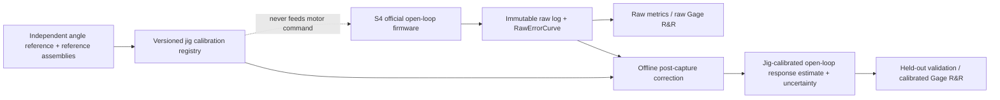

# Kế hoạch chuẩn hóa jig và Gage R&R cho Open-loop NL

**Ngày:** 2026-08-20  
**Trạng thái:** DRAFT FOR EXECUTION / chưa thay đổi firmware  
**Classification:** `OPEN_LOOP_MEASUREMENT`  
**Measurement contract:** `GREMSY_OPEN_LOOP_NL_1DEG360_V1`  
**Firmware baseline cần freeze:** S4 schema-v6, canonical 64-sample, 360 điểm, `FeedbackActuationEnabled=0`

## 0. Quyết định điều hành

Mục tiêu của kế hoạch này không phải làm hai jig cho ra cùng một con số bằng cách retune motor hoặc
trừ một offset tùy ý. Mục tiêu là xây một hệ đo có traceability đủ rõ để trả lời lần lượt:

1. jig/sensor-head tự tạo ra đường sai số nào khi đầu vào góc được biết độc lập;
2. remount, operator, day và môi trường đóng góp bao nhiêu variance;
3. cùng một motor có còn tạo kết quả khác nhau có hệ thống giữa các jig hay không;
4. một calibration curve độc lập có truyền được sang motor chưa dùng để xây calibration hay không.

Firmware S4, command profile, power, ramp, dwell, point grid, sample count, settle contract, công thức
và official raw DATA phải được giữ nguyên trong toàn bộ qualification. Mọi calibration chỉ được áp dụng
offline sau khi DATA đã đóng băng.

Không có product pass/fail NL threshold trong kế hoạch này. Các gate bên dưới là gate về tính hợp lệ và
năng lực của **hệ đo**, không phải giới hạn motor tốt/xấu.

## 1. Những bất biến không được phá

- Primary raw measurand vẫn là:

  ```text
  EncoderRelativeMeanAngle[i]
      = EncoderMeanAngleCanonical64[i] - EncoderMeanAngleCanonical64[0]
  ErrorRaw[i] = CommandAngle[i] - EncoderRelativeMeanAngle[i]
  RawOpenLoopNL = max(ErrorRaw[0..359]) - min(ErrorRaw[0..359])
  ```

- Official path không được dùng creep, recovery, learned feedforward, PID/FOC hoặc terminal correction.
- Một point/sweep không đạt stability/acquisition/closure phải invalid; không sửa command để cứu dữ liệu.
- `RawErrorCurve`, `RawOpenLoopNL`, extrema và log gốc là immutable.
- Calibration không được học từ motor-under-test đang được chấm.
- Không dùng circular shift tối ưu theo chính đường DUT để căn calibration; góc phải đến từ fiducial/reference độc lập.
- Không dùng một scalar offset chung để che curve-shape mismatch.
- PRECONDITION, invalid sweep và V5.x diagnostic không được vào Gage R&R official.
- Calibration/reference runs phải được đánh dấu trong external run manifest và không được đưa vào
  DUT/product statistics, kể cả khi firmware log của chúng có cấu trúc hợp lệ.
- Bất kỳ đổi sensor, gá, gap nominal, firmware, MA600 config, PSU/motor profile hoặc thuật toán analyzer
  đều làm thay đổi measurement state và phải tạo version/CalibrationID mới.

### 1.1 Measurement-contract impact matrix

| Workstream | Classification | Open-loop NL purpose | Raw V1 impact | ID/version phải khóa | Restart/retirement trigger |
|---|---|---|---|---|---|
| Q0 baseline freeze | `OPEN_LOOP_MEASUREMENT` governance | Traceability, validity | Không đổi | `MeasurementStateID`, firmware/analyzer hash, `MSR_V1` | Bất kỳ state/hash/requirement đổi |
| Q1 reference qualification | `DIAGNOSTIC_ONLY` cho characterization; S4 A/B vẫn raw V1 | Accuracy, traceability | Không đổi command/DATA | `ReferenceSystemID`, logger/profile version | Reference hết hạn, disturb, attachment effect |
| Q2 fixture DOE/SOP | `OPEN_LOOP_MEASUREMENT` state change | Repeatability, comparability | Có thể đổi whole-system response do fixture/gap | `MechanicalRevision`, SOP hash, state mới | Nominal/tolerance/fixture/load path đổi |
| Q3 calibration characterization | `DIAGNOSTIC_ONLY` | Accuracy, traceability | Không đổi raw V1 | `JIG_REFERENCE_CHARACTERIZATION_V1`, `CalibrationID` draft | Sensor/config/reference/fit protocol đổi |
| Q4 pilot | `OPEN_LOOP_MEASUREMENT`, evaluation-only | Repeatability, validity | Không đổi | `PilotStudyID`, run-manifest/schema hash | Design/state deviation |
| Q5 confirmatory Gage R&R | `OPEN_LOOP_MEASUREMENT`, evaluation-only | Comparability, reproducibility | Không đổi | `GageStudyID`, frozen model/tool/basis | Model, sampling frame hoặc state đổi |
| Q6 inverse/calibration analysis | Offline derived measurement contract | Accuracy, comparability | Raw V1 vẫn immutable | `DerivedMeasurementContractVersion`, `CalibrationID`, `PhysicalZeroMappingID` | Formula/map/model/validity scope đổi |
| T0 analysis toolchain | Analyzer/schema change | Traceability, acquisition integrity | Không đổi firmware; có thể đổi derived interpretation | `AnalyzerVersion`, tool SHA, report schema | Tool/model change làm restart downstream validation |
| Q8 deployment/surveillance | Raw V1 monitoring hoặc derived contract riêng | Drift control, comparability | Không overwrite raw | Production procedure + mapping + uncertainty version | Check-standard drift/maintenance/state change |

### 1.2 No-advance documentation gate

Sau **mỗi** hardware check, captured-log analysis, calibration evaluation hoặc pilot verdict trong Q1–Q6:

- [ ] append ngay `docs/session-summary-<YYYY-MM-DD>.md` của ngày đó;
- [ ] ghi step ID, vật được test, IDs/conditions, evidence đã kiểm tra, verdict và impact tới bước kế;
- [ ] hoàn thành session entry trước khi chạy hardware/evaluation step tiếp theo.

Không gom tài liệu cuối ngày và không advance khi checkbox này chưa đóng.

## 2. Baseline bằng chứng đã có

| Chỉ số | Kết quả hiện tại | Ý nghĩa cho plan |
|---|---:|---|
| Within-mount scalar CV | 0.41–1.61% | Repeatability cùng setup tốt |
| Within-mount curve correlation | 0.9976–0.9995 | Acquisition/firmware không phải nguồn mismatch chính |
| Cross-jig NL delta | 2.09–16.59%, product-dependent | JIG7/JIG8 chưa interchangeable |
| Cross-jig curve correlation | 0.9430–0.9851 | Sai khác không chỉ là scalar |
| Cross-jig A36 delta | 0.06–0.76% | Motor-periodic signature được giữ tốt |
| Remount NL delta quan sát | tới 17.47% | Remount có thể lớn bằng hoặc hơn jig effect |
| Config-minus-baseline H1-H2 fit | weighted R² 0.8131 | Low-order geometry là thành phần lớn |
| Config-minus-baseline H1-H6 fit | weighted R² 0.9017 | H1/H2 chưa đủ cho precision |
| Config-only LOO correction | tệ hơn no-correction 23.6–51.0% | Không được dùng correction chung học từ DUT |
| H36 residual, command vs `theta_start+index` | 0.0049° vs 0.5102° | `theta_start` không phải physical-angle datum chung |

Kết quả trên khóa hướng triển khai: firmware đã đủ tốt để freeze; phần còn thiếu là reference, cơ khí,
thiết kế thí nghiệm, uncertainty và qualification.

## 3. Kiến trúc dữ liệu mục tiêu



Hai kết quả phải luôn tồn tại song song:

1. `Raw whole-system open-loop NL` — official S4 measurand, không sửa.
2. `Jig-calibrated open-loop response estimate` — một derived measurand riêng, chỉ hợp lệ khi
   CalibrationID và held-out validation pass.

`GREMSY_OPEN_LOOP_NL_1DEG360_V1` chỉ có **một official output** là raw whole-system result. CalibrationID
không tự biến derived output thành cùng measurement contract. Nếu dự án muốn dùng derived output trong
production, phải phê duyệt riêng một contract có version, ví dụ
`JIG_CALIBRATED_OPEN_LOOP_RESPONSE_ESTIMATE_V1`, với intended use và uncertainty riêng. Derived contract
không được gọi là motor-only NL vì magnet/mount/driver interaction vẫn còn. Chỉ `RAW_INTERCHANGEABLE` mới
đóng trực tiếp mục tiêu đồng bộ raw open-loop NL của contract V1; derived output chỉ đóng mục tiêu đó nếu
có một governance decision tường minh thay đổi/ mở rộng authoritative measurement objective.

Nếu calibration không transfer được sang held-out motors, chỉ kết quả raw được giữ; hai jig không được
tuyên bố interchangeable.

## 4. Phase Q0 — Freeze baseline và khóa Measurement System Requirement

### Q0.1 Freeze artifact

- [ ] Chọn đúng S4 `.hex/.elf/.map` đã tạo log schema-v6 hiện tại.
- [ ] Lưu SHA256 artifact, git commit, branch, `BuildID`, `ProfileFingerprint` và build manifest.
- [ ] Khóa `MeasurementContractVersion=GREMSY_OPEN_LOOP_NL_1DEG360_V1`.
- [ ] Khóa motion/grid/power/sample/settle/precondition/cooldown contract.
- [ ] Khóa MA600 expected profile và zero correction table.
- [ ] Khóa version của parser/analyzer và fixtures kiểm thử.
- [ ] Không dùng `QuickScreen3Run` làm qualification; nếu dùng để screening cơ khí phải ghi
  `DIAGNOSTIC_ONLY` và xác nhận lại bằng standard 10-official S4 batch.

### Q0.2 Inventory measurement system

Tạo registry cho từng jig:

| Field bắt buộc | Ví dụ/ý nghĩa |
|---|---|
| JigID + MCU UID | JIG7/JIG8 và UID thật |
| SensorHeadID | serial nội bộ cho PCB/sensor-head |
| MA600 physical unit/revision | nhận biết sensor swap |
| Mechanical fixture revision | revision gá, shim, bearing support |
| Magnet/shaft interface revision | cách bắt reference/DUT |
| PSU/driver ID | phần cứng cấp nguồn và driver |
| MA600 config fingerprint | Zero/Dir/Filt/Status/Prt/Rmap/CorrCRC |
| Last disturbed date | lần cuối tháo sensor/gá |
| CalibrationID hiện hành | trống cho tới Q3/Q4 |

### Q0.3 Khóa yêu cầu hệ đo trước khi xem dữ liệu qualification

Chủ dự án phải định nghĩa một `MSR_V1` gồm:

- smallest engineering-significant motor difference cần phân biệt;
- cross-jig scalar difference tối đa cho phép;
- centered full-curve RMSE tối đa;
- yêu cầu correlation/ranking và xác suất mis-ranking cho phép;
- calibration validity period và drift allowance;
- reference uncertainty target.

Mỗi requirement phải là một dòng executable, có đủ:

```text
Metric/estimand | population/unit | aggregation level | absolute/relative margin
CI/equivalence method | confidence coverage/alpha | desired power/beta
allowed failed motors/groups | missing/invalid handling | decision rule
```

Estimands tối thiểu cần khóa trước data:

- scalar: paired per-motor jig difference `D_m=E(NL_m,J7-NL_m,J8)` và prediction interval cho `D_new`
  gồm motor×jig/remount/session; equivalence chỉ pass khi CI/PI nằm trọn trong `[-DeltaNL,+DeltaNL]`;
- full curve: `d_m(theta)=E_raw,m,J7(theta)-E_raw,m,J8(theta)` trong fixed zero-shift frame;
  simultaneous `(1-alpha)` band phải nằm trong envelope đã phê duyệt và upper CI của centered RMSE phải
  nhỏ hơn `DeltaRMSE`;
- harmonic/extrema: complex-vector distance, circular extrema distance/top-k overlap, margin và simultaneous
  family coverage tường minh; không dùng 360 p-value rời;
- ranking: lower confidence bound của metric đã chọn và upper bound của new-motor mis-ranking probability;
- acquisition: one-sided upper CI của invalid probability và differential invalidity giữa jig/session;
- repeat/remount/reproducibility: upper confidence bound của từng variance component so với component budget.

TOST hoặc cluster-bootstrap equivalence đều được, nhưng alpha/beta/coverage và cluster unit phải freeze.
Default không cho một subgroup fail rồi average che đi; nếu cho phép failed group phải predeclare đúng nhóm
và số lượng. `%StudyVariation`, ICC/ranking chỉ có ý nghĩa đối với motor population được chọn có chủ đích
trong study, không tự suy rộng thành fleet capability.

Không lấy chính dataset qualification để chọn các giới hạn này. Nếu chưa có product tolerance thì
không dùng `%Tolerance`; báo variance components, `%StudyVariation`, ICC/ranking và confidence interval.
CV ≤2% hiện có chỉ là pilot target cho same-mount repeatability, không phải cross-jig gate.

Engineering target 4:1 áp dụng cho **combined installed expanded uncertainty của cross-jig difference** ở
coverage factor đã ghi, không áp riêng từng reference/jig. Tính cả covariance dùng chung, ví dụ
`U_delta=k*sqrt(u_J7^2+u_J8^2-2cov_J7,J8+u_alignment^2+...)`, và yêu cầu `U_delta` không lớn hơn 25% effect
nhỏ nhất cần phân giải. Effect, k/coverage và model phải khóa trong `MSR_V1`, không suy ngược sau khi test.

### Gate Q0

- Artifact/schema/analyzer và registry đã freeze, có hash.
- `MSR_V1` đã được phê duyệt hoặc plan phải ghi rõ qualification chỉ có thể trả về `INCONCLUSIVE`.
- Không có thay đổi chưa ghi nhận trên sensor-head/gá/PSU/MA600 config.

## 5. Phase Q1 — Xây chuẩn góc cơ khí/từ trường độc lập

### Q1.1 Phương án A — absolute reference, ưu tiên

Thiết kế một reference rig gồm:

- rotary stage hoặc reference encoder đọc cùng trục, độc lập với MA600 của jig;
- ưu tiên optical ring encoder; nếu khả thi dùng hai readhead đối diện để giảm ảnh hưởng eccentricity của
  scale. Không dùng thêm bearing làm over-constrain hoặc side-load trục motor;
- reference encoder phải nonmagnetic và có tải/mô-men đủ nhỏ để không làm đổi open-loop response;
- adapter dùng three-point kinematic locating + hard axial stop, không lấy lực siết làm datum định vị;
- shaft có mechanical index/fiducial cố định và lặp lại được;
- reference magnet diametrically magnetized, có đánh dấu orientation/N-S hoặc được map bằng gaussmeter/3-axis Hall probe;
- adapter lắp được lên mọi jig mà không thay đổi datum;
- cách đo trực tiếp gap, eccentricity và tilt;
- acquisition timestamp đồng bộ đủ để ghép `ThetaReference` với `MA600Raw`.

Nếu reference encoder được gắn trực tiếp khi chạy S4, external logger phải bắt đúng point/canonical
capture window từ UART/trigger thay vì ghép bằng thời gian ước lượng. Phải làm A/B attached-versus-detached
để chứng minh reference encoder/adapter không tạo thêm tải hoặc từ trường làm đổi measurand. Nếu attachment
effect có ý nghĩa so với `MSR_V1`, reference chỉ được dùng trên calibration rig, không dùng trong S4 DUT run.

Phương án đồng bộ mạnh nhất là passive, high-impedance logger quan sát `CS/SCLK/MISO` và reference encoder,
reconstruct đúng 64 accepted MA600 sample/canonical point rồi đối chiếu counters trong S4 log. Nếu không
ghép được reference samples với official canonical window một cách duy nhất, cặp dữ liệu đó không được dùng
để xây calibration.

Reference encoder phải có calibration certificate/uncertainty hoặc tối thiểu được kiểm chứng bằng một
chuẩn tốt hơn. Ghi serial, calibration date, resolution, accuracy, uncertainty và environmental range.
Certificate phải áp dụng cho encoder/readhead/scale ở trạng thái installed hoặc uncertainty budget phải
bao gồm toàn bộ sai số do lắp đặt; encoder resolution đơn thuần không phải bằng chứng về accuracy.

### Q1.2 Phương án B — transfer/check standard, fallback có giới hạn

Một assembly shaft+magnet+mechanical index cố định chuyển qua các jig **không tự tạo ra 360 góc đã biết**.
Nếu để chính motor open-loop quay assembly, góc rotor chưa biết vẫn là confound cần giải. Assembly kiểu này
chỉ được dùng làm check standard theo dõi drift/repeatability, không được dùng để sinh calibration curve.

Muốn làm relative calibration, transfer assembly vẫn phải được ghép với external indexed rotary positioner
hoặc master readout có khả năng đặt/đọc 360 góc độc lập. Khi đó report mang
`TraceabilityClass=RELATIVE_INDEXED_TRANSFER_STANDARD`; không được tuyên bố absolute motor/sensor INL.

Một transfer standard duy nhất không đủ để chứng minh correction phổ quát vì chính magnet/assembly có
error riêng. Planning minimum là **hai development assemblies** (`DEV-A`,`DEV-B`) để fit/model-selection
bằng nested leave-one-assembly-out, cộng **một untouched confirmatory assembly** (`CONF-C`) chỉ được mở sau
khi model/CalibrationID freeze. Simulation Q4 có thể yêu cầu nhiều hơn. Assembly đã dùng chọn H1-H6 so với
H1-H18 không còn là final holdout.

### Q1.3 Characterize chính reference rig

- [ ] 3 sweep CW + 3 sweep CCW không remount để đo repeatability/hysteresis.
- [ ] Ít nhất 3 remount reference assembly để đo seating repeatability.
- [ ] Không mặc định dùng 0/90/180/270°: set này alias mọi harmonic bội 4 (gồm H4/H12/H36).
- [ ] T0 chọn một set indexed, non-commensurate bằng D-optimal/condition-number simulation sao cho complex
  harmonic design matrix full-rank và well-conditioned cho toàn bộ frozen model orders; khóa exact offsets,
  index uncertainty và condition-number gate trước hardware run.
- [ ] Lặp trên ít nhất 2 ngày để phát hiện drift.
- [ ] `DEV-A/DEV-B` chạy randomized ABBA/BAAB trên full-rank indexed orientation set; nested
  leave-one-assembly-out chỉ dùng để fit/model-selection trong development split.
- [ ] `CONF-C` là final confirmatory holdout và cũng dùng một predeclared full-rank/well-conditioned
  orientation set; 0/180° riêng lẻ không đủ vì alias mọi even harmonic. Không dùng `CONF-C` để refit.
- [ ] Chạy check-standard trước và sau mỗi session; full power-cycle là một block riêng.
- [ ] Đo field tại sensor position; MA600 không có field-strength register nên không suy từ SPI status.
- [ ] Xác nhận reference uncertainty và alignment uncertainty đáp ứng `MSR_V1`.

### Gate Q1

- Có physical zero độc lập; không dùng `theta_start_deg` làm datum.
- Reference repeatability, reversal/hysteresis, remount và uncertainty đã được định lượng.
- Nếu chỉ có fixed assembly mà không có external indexed angle/readout, chỉ được chạy drift/check-standard;
  calibration state phải là `CALIBRATION_REFERENCE_INSUFFICIENT`.
- Relative calibration phải có external indexed positioner/readout và mang
  `TraceabilityClass=RELATIVE_INDEXED_TRANSFER_STANDARD`.
- Nếu reference không đủ năng lực so với `MSR_V1`, dừng trước calibration; vẫn có thể chạy raw Gage R&R.
- [ ] No-advance session entry Q1 đã ghi evidence/IDs/conditions/verdict trước Q2/Q3.

## 6. Phase Q2 — DOE mounting và khóa SOP cơ khí

### Q2.1 Các yếu tố phải đo hoặc kiểm soát

- sensor-to-magnet gap;
- concentricity/eccentricity;
- sensor/magnet tilt;
- orientation theo mechanical fiducial;
- clamp force/torque và trình tự siết;
- bearing/shaft axial/radial preload;
- magnet part, dimension, field strength và magnetization direction;
- seating path/contact surfaces;
- ambient, sensor/motor temperature, PSU voltage và thời gian từ lần chạy trước.

Điểm bắt đầu theo controlled source `MA600A.pdf`, sections `Sensor (Magnet Mounting)` / `End-of-Shaft
Mounting` (Figure 6/32), được tóm tắt tại `docs/end-of-shaft-mounting-test-plan.md`: end-of-shaft on-axis,
concentricity nhỏ hơn 5% đường kính magnet và field nằm trong vùng khuyến nghị của sensor. Q0 phải ghi
datasheet revision/SHA và phương pháp đo eccentricity/field; nếu revision chưa xác định thì đây chỉ là
screening guidance. Các giá trị này không phải NL product limit.

### Q2.2 Screening DOE, tách khỏi Gage R&R

Không trộn DOE chọn nominal với dataset qualification. Tách hai DOE:

**Q2.2a — sensor-head/reference-fixture DOE:** dùng external reference để screening gap, sensor/magnet
tilt/eccentricity, field, indexed orientation và reference seating. DOE này chỉ qualify đường cảm biến/
reference adapter; không đại diện tự động cho production motor load path.

**Q2.2b — production motor-fixture/SOP DOE:** dùng development motors thật và, khi có thể, reference
attachment đã qua perturbation A/B/A để screening clamp torque, seating path, bearing/shaft axial-radial
preload, motor magnet geometry, cable load, driver/PWM và motor×mount response. Nếu dùng surrogate shaft,
phải chứng minh load path/curve response tương đương production fixture trong `MSR_V1`; nếu không, surrogate
chỉ được dùng để căn sensor, còn DUT SOP chưa qualified.

Trong từng DOE:

1. gap low/center/high trong vùng cơ khí hợp lệ;
2. clamp torque low/center/high bằng dụng cụ đã hiệu chuẩn;
3. indexed orientation;
4. seating path hoặc fixture revision;
5. đo tilt/eccentricity làm covariate thực, không chỉ nhãn nominal.

Ưu tiên thiết kế factorial/fractional-factorial cân bằng và randomize order. Chọn nominal tại vùng
response ít nhạy với thay đổi nhỏ, không chọn chỉ vì scalar NL thấp nhất. Đánh giá full curve, complex
H1/H2/H4/H12, extrema, A36, reference error và repeatability.

### Q2.3 Mounting SOP

SOP cuối phải mô tả:

- dụng cụ, shim/hard-stop và calibration status;
- trình tự làm sạch, đặt motor, căn fiducial, siết từng bước;
- nominal và tolerance của gap/torque/orientation/tilt/eccentricity;
- cách ghi actual measured values;
- tiêu chí reject setup trước khi chạy firmware;
- ảnh chuẩn và lỗi điển hình;
- trigger phải remount hoặc recalibrate.

Tolerance chỉ được khóa từ capability của reference rig + DOE + `MSR_V1`, không lấy một mount đẹp làm chuẩn.

### Gate Q2

- DOE chỉ ra nominal/tolerance có margin, không dựa vào minimum RawP2P.
- Sensor-head/reference fixture và production motor-fixture/load path đều đã được đánh giá; surrogate
  equivalence pass hoặc controlled actual-motor/reference check đã hoàn tất.
- Hai operator thực hiện production DUT SOP (không chỉ reference assembly) và tạo kết quả nằm trong
  measurement-system margins đã khóa.
- Mọi actual gap/torque/orientation được ghi; không còn nhãn mơ hồ như `low/high` hoặc đơn vị không rõ.
- Assign `MechanicalRevision` và `MeasurementStateID` cuối; hash SOP/registry/tooling, retire mọi
  CalibrationID cũ và re-freeze state Q0 trước Q3/Q4.
- [ ] No-advance session entry Q2 đã ghi evidence/IDs/conditions/verdict trước Q3/Q4.

## 7. Phase Q3 — Characterize từng sensor-head/jig

### Q3.1 Thiết kế acquisition calibration

Với mỗi jig/sensor-head:

- characterization map phải dùng external positioner/reference theo chế độ static step-and-dwell;
  rotor angle chỉ được chốt sau khi reference stability pass. Motor drive không được dùng làm angle truth;
- calibration acquisition là profile riêng `JIG_REFERENCE_CHARACTERIZATION_V1`, classification
  `DIAGNOSTIC_ONLY`, `OfficialOpenLoopNL=0`, `EligibleForStatistics=0` trong external manifest. Nó không
  thay thế và không được pooled với S4 DUT measurement;
- output của forward map `F_j` phải là đúng canonical `MeanUnwrappedRawQ16` representation mà S4 dùng,
  sau cùng frozen ZERO/DIR/FILT/RMAP/CORR configuration, unwrap và sign convention. Không fit map trên
  pre-LUT/raw register rồi áp vào post-config mean hoặc ngược lại;
- characterization phải reuse cùng thuật toán 64 accepted samples, sample acceptance/transport counters,
  unwrap và timing của S4. Nếu acquisition timing khác vì static stage, phải quantify equivalence, version
  difference và pass `MSR_V1` trước khi map được deploy;
- dùng reference angle grid bằng hoặc mịn hơn grid official; xuất curve về grid 1° bằng periodic interpolation;
- chạy nhiều reference assemblies và indexed orientations;
- mỗi setup có nhiều CW/CCW sweep, nhiều remount, ít nhất hai ngày;
- thiết kế phải cân bằng/crossed `jig × reference assembly × indexed orientation × direction × day`;
  remount là independent nested event trong mỗi cell, không dùng nhãn remount như crossed factor;
- S4 A/B attached test chỉ chứng minh reference attachment không perturb measurand; calibration map không
  được suy ra từ open-loop command index;
- ghi đồng thời `ThetaReference`, `MA600Raw/Mean`, direction, gap, field, torque, orientation,
  temperature, config fingerprint và timestamp.

Mô hình characterization tối thiểu:

```text
ReferenceError[jig, ref, orientation, remount, theta]
    = GrandMeanCurve[theta]
    + JigFixedCurve[jig, theta]
    + ReferenceAssemblyCurve[ref, theta + orientation]
    + DirectionCurve[direction, theta]
    + DayCurve[day, theta]
    + Jig×ReferenceInteraction[jig, ref, theta]
    + Jig×DirectionInteraction[jig, direction, theta]
    + RemountCurve[jig, ref, orientation, day, remount, theta]
    + RepeatNoise[theta]
```

Mọi curve phải ở physical-reference coordinate frame; orientation offset là giá trị indexed đã biết,
không phải shift fitted từ response. Để mô hình identifiable, dùng periodic harmonic/spline basis đã freeze
và constraints tường minh, ví dụ `GrandMeanCurve` tự do, `sum_j JigFixedCurve=0`,
`sum_ref ReferenceAssemblyCurve=0`, `sum_direction DirectionCurve=0`, `sum_day DayCurve=0`, interaction có
row/column sums bằng zero (hoặc khóa reference levels tương đương). Remount/day/direction là functional
effects trên basis coefficients, không phải scalar offset. Uncertainty dùng curve covariance và cluster
bootstrap theo assembly/remount/day.

CW/CCW dùng để phát hiện hysteresis, không được average mù. Map phát hành cho S4 phải lấy đúng direction và
approach history của S4. Nếu DirectionCurve/Jig×Direction vượt margin, phát hành direction-specific map hoặc
trả `CALIBRATION_NOT_IDENTIFIABLE`; nếu DayCurve/drift vượt margin, rút validity interval hoặc reject map.
Chỉ được drop một effect khi equivalence gate predeclared chứng minh nó negligible trên development data,
và quyết định drop được freeze trước `CONF-C`.

Nếu Jig×Reference interaction hoặc remount-curve uncertainty vượt `MSR_V1`, hoặc leave-one-assembly-out
không transfer, không ép thành `JigFixedCurve`: trả `CALIBRATION_NOT_IDENTIFIABLE` và không phát hành map.

### Q3.2 Calibration artifact

Mỗi artifact cần:

```text
CalibrationID
JigID / MCU_UID / SensorHeadID / MechanicalRevision
ReferenceSystemID / ReferenceAssemblyIDs
TraceabilityClass / reference uncertainty
MA600 config fingerprint
physical-zero definition
gap/torque/orientation/temperature validity range
grid and sign convention
forward transfer `ThetaMA600=F_j(ThetaPhysical)`, inverse map `F_j^-1`, pointwise uncertainty
curve/basis-coefficient covariance or reproducible bootstrap/Monte-Carlo draw artifact
fit/smoothing algorithm version
valid-from / expiry / recalibration triggers
source data hashes / artifact SHA256 / approval state
```

Không ghi correction vào MA600 LUT trong phase này. ZERO_TABLE vẫn là official S4 state.

### Q3.3 Model candidates

So sánh trước khi chọn:

- pointwise periodic mean curve;
- Fourier H1-H6;
- Fourier H1-H18;
- model có reference/mount interaction.

H1-H6 hiện giải thích khoảng 90.2% config response nhưng không được mặc định là đủ. Chọn model bằng nested
leave-one-assembly-out trong `DEV-A/DEV-B`, không bằng fit score trên chính batch. Refit locked model trên
development split, rồi mở `CONF-C` đúng một lần cho final confirmation; `CONF-C` không được dùng đổi order.

### Gate Q3

- Physical angle/reference validity pass.
- Calibration artifact tái lập được từ source hashes.
- `CONF-C` calibration residual/expanded uncertainty đạt predeclared calibration-accuracy target trong
  `MSR_V1`; chỉ "không làm xấu" là chưa đủ.
- Có uncertainty curve; không chỉ có một offset hoặc một scalar NL.
- Model constraints/coordinate frame tái lập được; không rơi vào `CALIBRATION_NOT_IDENTIFIABLE`.
- Sensor swap hoặc fixture disturbance tự động retire CalibrationID cũ.
- [ ] No-advance session entry Q3 đã ghi evidence/IDs/conditions/verdict trước Q4/Q5.

## 8. Phase Q4 — Pilot Gage R&R nhỏ, raw trước calibration

Pilot tối thiểu kế thừa roadmap hiện có:

- 2 motor: một unit đã ổn định và một unit đã nhạy với remount/low-order response;
- 2 jig: JIG7 và JIG8;
- 3 remount độc lập cho mỗi motor×jig;
- 1 operator để trước hết tách jig/remount;
- mỗi mount chạy standard S4 batch: 1 PRECONDITION + 10 OFFICIAL;
- tổng: 12 batch, 120 official sweep + 12 precondition.

P03 là ứng viên stable; P010 hoặc P013 là ứng viên mounting-sensitive theo dữ liệu hiện có. Chọn và
khóa serial trước khi randomize.

### Q4.1 Randomization

- Tạo run sheet bằng seed cố định và lưu seed.
- Interleave jig/motor; không chạy hết JIG7 rồi mới JIG8.
- Mỗi `remount` phải tháo hoàn toàn và lắp lại theo SOP.
- Block theo day/shift; ghi time order để kiểm tra drift/thermal carry-over.
- Không thay label motor bằng trí nhớ operator; MotorID phải có traveler/QR/manual double-check.
- Failed/invalid logs vẫn được lưu. Rerun là một batch mới, không overwrite batch fail.

Tên log đề xuất:

```text
QRR-PILOT-<MotorID>-<JigID>-OP<id>-D<day>-R<remount>-S4-OLNL-V1.txt
```

### Q4.2 Data integrity gate

Trước khi đo phải freeze `intention-to-measure` run sheet. Mọi first-attempt cell — kể cả fail — là một
observation của acquisition-integrity outcome và không được biến mất khi rerun. Với từng sweep hợp lệ dùng
cho curve/NL model, yêu cầu:

- đúng frozen BuildID/contract/config/calibration state;
- precondition valid;
- đủ 360 official point và closure theo contract;
- không transport/jump/context error;
- cooldown/thermal/environment record đầy đủ.

Không bắt buộc cell phải 10/10 valid rồi mới được tồn tại trong study: làm vậy sẽ condition kết quả lên
những cell dễ đo và đánh giá thấp invalidity. Báo riêng `valid official sweeps / 10`, loại từng invalid sweep
khỏi metric model theo contract nhưng giữ cell trong binomial/acquisition-validity analysis. Mọi replacement
là batch mới có `ReplacementFor=<BatchID>`; primary analysis giữ first attempt, sensitivity analysis mới
được báo thêm có/không flagged replacement. Mười official sweep chỉ là technical repeats nested trong mount,
không tạo thêm degrees of freedom cho jig/operator/remount.

### Q4.3 Pilot analysis

Phân tích riêng:

1. sweep-to-sweep repeatability trong cùng mount;
2. remount variance trong cùng motor×jig;
3. jig main effect;
4. motor×jig interaction;
5. full curve, extrema, H1-H6/H12/H36 và scalar RawOpenLoopNL;
6. raw versus independently calibrated result, nhưng calibration không được retune từ pilot motors.

### Gate Q4

- Thiết kế cân bằng và data integrity pass.
- Mô hình variance components chạy được mà không coi 10 sweep là 10 remount độc lập.
- Không có labeling/config/reference ambiguity.
- Pilot chỉ quyết định có đủ điều kiện sang full Gage R&R; không tạo product limit.
- [ ] No-advance session entry Q4 đã ghi first-attempt/invalid/replacement evidence và verdict trước Q5.

## 9. Phase Q5 — Full randomized crossed Gage R&R

### Q5.1 Planning envelope; cỡ mẫu cuối phải khóa bằng simulation

- planning start: 6–10 reference motors, phủ dải RawP2P, A36 và low-order response đã quan sát;
- tất cả jig sẽ dùng thay thế nhau trong production, bắt đầu với JIG7/JIG8;
- tối thiểu 2 operators và 2 ngày chung trong planning template;
- mỗi motor×jig xuất hiện trong mọi `OperatorDaySession` theo thiết kế cân bằng;
- 2 independent remounts trong từng motor×jig×session cell; tổng số remount/cell có thể tăng theo simulation;
- standard 10-official S4 batch cho mỗi mount.

Con số motor/session confirmatory không được chốt tùy ý. Sau Q4, dùng variance components và invalidity
rate để simulation power/CI precision đối với chính `MSR_V1`; freeze cỡ mẫu trước Q5. Không giảm số motor
hoặc phá crossing motor×jig chỉ để tiết kiệm thời gian — extra sweep chủ yếu ước lượng repeat noise đã nhỏ.

Planning matrix tường minh (không phải universal minimum):

```text
Motor           = 6 units
Jig             = JIG7, JIG8
Session         = OP1-D1, OP2-D1, OP1-D2, OP2-D2
Remount/session = 2 independent full removals/reinstalls
Batch/remount   = 1 PRECONDITION + 10 OFFICIAL

BatchCount      = 6 × 2 × 4 × 2 = 96
OfficialSweeps  = 96 × 10 = 960
Preconditions   = 96
```

Mỗi motor×jig phải xuất hiện trong cả bốn session; jig order được counterbalance `ABBA/BAAB` và motor
order được randomize bằng saved seed trong từng ngày. Mount/batch là experimental unit ở cấp jig/operator/
session; 10 sweep là serial technical repeats nested trong mount. Planning matrix này ước lượng combined
`OperatorDaySession` reproducibility. Đây không phải universal minimum. Thời gian bench phải tính từ median
duration của log S4 thật:

```text
TotalTime = (MainBatchCount + SealedHoldoutBatchCount) × MedianS4BatchDuration
          + remount/metrology time
          + invalid-cell contingency
```

Không rút ngắn protocol giữa chừng sau khi nhìn thấy kết quả.

Nếu cần tách `Operator` và `Day` thành hai variance component độc lập, dùng ít nhất 3 operators trên ít
nhất 3 ngày chung, mỗi operator xuất hiện trên mọi day và motor×jig được cross đầy đủ; cỡ mẫu phải simulation
lại. Với planning matrix 2×2 phía trên, report combined `OperatorDaySession`, không gọi component đó là
operator-only hoặc day-only.

Một sealed Q6 holdout gồm motor mới và session muộn hơn phải nằm ngoài mọi quyết định model/calibration.
Số lượng cuối lấy từ Q4 simulation và được freeze cùng exact MotorID/cell schedule trước Q5. Planning start:

```text
HoldoutMotor           = 6 new untouched units
Jig                    = JIG7, JIG8
LaterSession           = 3 predeclared OperatorDaySessions
Remount/session        = 2 independent remounts
Batch/remount          = 1 PRECONDITION + 10 OFFICIAL

SealedHoldoutBatchCount = 6 × 2 × 3 × 2 = 72
HoldoutOfficialSweeps   = 72 × 10 = 720
HoldoutPreconditions    = 72
PlanningTotalBatches    = 96 main + 72 holdout = 168
```

Holdout runs được acquisition theo frozen schedule sau khi CalibrationID/model/tool/margins đã khóa, và chỉ
được unseal/analyze tại Q6. Không tái dùng development/Q4/Q5-main motors rồi gọi là holdout. Simulation có
thể tăng/giảm planning start nhưng phải bảo toàn motor×jig crossing, later-session coverage và CI/power của
`MSR_V1`; exact count phải xuất hiện trong saved run manifest và bench-time budget.

### Q5.2 Cấu trúc thống kê

Sweep nằm trong remount; remount được nested trong motor×jig×operator-day session. `Remount01` trên JIG7
không phải cùng factor level với `Remount01` trên JIG8. Không coi sweep hoặc 360 angle là independent part.
Mô hình scalar tham chiếu:

```text
Y[m,j,q,r,s] = mu
               + Motor[m]
               + Jig[j]
               + OperatorDaySession[q]
               + Motor×Jig[m,j]
               + Jig×Session[j,q]
               + Motor×Session[m,q]
               + Remount[m,j,q,r]
               + SweepResidual[m,j,q,r,s]
```

Hai jig JIG7/JIG8 phải được coi là fixed effects; hai level không đủ để suy ra random variance của toàn
fleet jig. Motor/remount/sweep là random effects. Báo rõ model convention và confidence/prediction interval.
Nếu n nhỏ, không diễn giải p-value đơn lẻ như bằng chứng nhân quả hoặc `p>0.05` như equivalence.

Kiểm tra sweep-order/thermal drift; nếu pilot cho thấy autocorrelation thì dùng AR(1) hoặc random slope.
Chạy sensitivity model trên log(OpenLoopNL) vì extrema P2P có thể heteroscedastic.

### Q5.3 Metric family

Primary vẫn là raw `OpenLoopNL_Deg`, nhưng qualification phải báo đồng thời:

- full centered 360-point curve;
- centered RMSE và zero-shift correlation;
- complex Fourier coefficients `(a_k,b_k)`, không chỉ amplitude/phase, cho H1-H6, H12, H36;
- extrema angle/family và top/bottom set overlap;
- RobustP2P, RMS_AC, closure và acquisition validity;
- motor ranking/ICC/Spearman với cluster bootstrap confidence intervals;
- variance components và tỷ lệ contribution của repeat, remount, jig và interaction.

Phase của harmonic có amplitude gần zero không được dùng riêng vì không xác định tốt.
Không chạy 360 unadjusted hypothesis tests; dùng functional mixed model/basis đã freeze và simultaneous
confidence bands. P2P uncertainty phải propagate covariance của cả curve bằng cluster bootstrap/Monte
Carlo, không coi max và min là hai endpoint độc lập.

### Q5.4 Raw và calibrated model

Chạy hai model song song:

1. `RAW`: dữ liệu S4 nguyên bản.
2. `JIG_CALIBRATED_RESPONSE_ESTIMATE`: chỉ dùng derived-contract version và CalibrationID đã freeze trước Q5.

Calibration development motors/reference assemblies và qualification motors phải tách biệt. Không sửa
harmonic order, phase alignment, scale hoặc jig curve sau khi nhìn Q5. Nếu cần sửa, tạo CalibrationID mới
và chạy một qualification dataset độc lập khác.

### Gate Q5

Q5 chỉ được trả một trong các trạng thái trước holdout:

- `RAW_INTERCHANGEABLE`: raw đáp ứng toàn bộ `MSR_V1`; không cần Q6 correction để đóng raw objective.
- `DERIVED_VALIDATION_PENDING`: raw fail, failure mechanism là jig-fixed bias đủ điều kiện calibration,
  và frozen derived candidate đang chờ sealed Q6 holdout.
- `NOT_INTERCHANGEABLE`: motor×jig/remount/driver interaction hoặc failure mechanism không calibratable.
- `INCONCLUSIVE`: reference, balance, uncertainty hoặc sample size không đủ.

Q5 không được phát `DERIVED_CALIBRATED_COMPARABLE`; chỉ Gate Q6 được phát trạng thái đó. Không trạng thái
nào là motor product pass/fail.
- [ ] No-advance session entry Q5 đã ghi model/version, first-attempt validity, CI/PI và verdict trước Q6.

## 10. Phase Q6 — Công thức correction và held-out validation

Q6.1/Q6.3/Q6.4 là contract/protocol phải implement, test và freeze qua T0 **trước** khi Q3 tạo artifact;
Q6.2 là phép transfer/holdout được thực thi sau confirmatory Q5. Không được viết công thức hoặc chọn model
sau khi nhìn holdout.

### Q6.1 Dùng inverse transfer map, không trừ curve tại một góc chưa biết

Calibration rig phải xác định một hàm đơn điệu, tuần hoàn:

```text
ThetaMA600_j = F_j(ThetaPhysical)
```

Trong DUT run, `ThetaPhysical` thật chính là đại lượng chưa biết; vì vậy không được trực tiếp lấy một
calibration-error curve tại `ThetaPhysical[i]` như thể góc này đã biết. Phải invert transfer map offline:

```text
ThetaEstimatedPhysical[i]
    = F_j^-1(MeanUnwrappedMA600[i], PhysicalZeroMapping)

JigCalibratedResponseEstimateError[i]
    = CommandRelativeAngle[i]
      - (ThetaEstimatedPhysical[i] - ThetaEstimatedPhysical[0])
```

Sau đó mới tính `JigCalibratedResponseEstimateNL=max-min` trên đúng **cùng 360 corrected samples** tương ứng
360 official canonical points. Dense interpolation/oversampled extrema chỉ là supporting metric trừ khi
derived contract mới định nghĩa rõ khác. Periodic inverse interpolation phải được test monotonic, wrap-safe
và uncertainty-aware. Với sai số nhỏ, phép trừ calibration-relative curve là xấp xỉ bậc nhất,
nhưng không được dùng làm định nghĩa production khi inverse map đã có.

`PhysicalZeroMapping` phải đến từ keyed mechanical/magnetic fiducial độc lập. Không được fit offset bằng
cách dịch curve DUT để làm correlation đẹp hơn. Nếu mỗi DUT không có cách map raw sensor angle vào cùng
physical datum thì jig-calibrated response estimate không deploy được, dù calibration-rig fit có đẹp.

### Q6.2 Transfer checks bắt buộc

- held-out motors chưa dùng để chọn calibration model;
- held-out reference assemblies/orientations;
- cross-day và sau controlled remount;
- leave-one-motor-out/jig checks;
- raw versus corrected centered RMSE, curve correlation, extrema và ranking;
- xác nhận A36/motor fingerprint không bị correction làm méo ngoài uncertainty;
- kiểm tra correction không giúp average nhưng làm một nhóm motor xấu đi có hệ thống.

Kết quả hiện tại đã cho thấy config-only correction học từ DUT làm unseen motor tệ hơn 23.6–51.0%; do đó
held-out transfer là hard gate, không phải optional analysis.

### Q6.3 Stop rules

Dừng correction và quay lại hardware/SOP nếu:

- cần phase shift fit từ từng DUT;
- correction chỉ tốt trên development set;
- sign/magnitude correction đổi theo motor;
- motor×jig interaction vẫn chi phối residual;
- reference uncertainty hoặc alignment uncertainty cùng thang với improvement;
- calibration làm xấu A36, ranking hoặc full-curve metrics;
- sensor/gá bị thay đổi nhưng vẫn dùng CalibrationID cũ.

### Q6.4 Uncertainty budget và hard-stop metrology

Type A phải bao gồm tối thiểu: sweep repeatability, remount, keyed orientation, session/operator-day,
standard-to-standard variation và độ lặp lại của việc ghép reference window.

Type B phải bao gồm tối thiểu:

- certificate/cyclic map/interpolation của reference encoder;
- installed scale/readhead eccentricity, shaft runout và fiducial-index uncertainty;
- timestamp skew và motion trong canonical window;
- coupling torsion hoặc mô-men/tải thêm do reference attachment;
- metrology uncertainty của gap, tilt, eccentricity và clamp torque;
- temperature coefficient, supply drift, magnet field/geometry;
- MA600 canonical-window quantization/noise.

Do P2P/extrema là hàm phi tuyến của 360 điểm tương quan, propagate toàn bộ curve covariance bằng
cluster bootstrap hoặc Monte Carlo. Không tính uncertainty của P2P như tổng của hai endpoint độc lập.
Báo expanded uncertainty cho pointwise curve và từng derived metric, kèm coverage factor/phương pháp.

Hard-stop hoặc invalidate phạm vi dữ liệu bị ảnh hưởng nếu xảy ra một trong các điều sau:

- S4 contract/config/acquisition/stability/closure/360-point completeness không hợp lệ;
- external logger không thể tái tạo và ghép duy nhất canonical 64-sample window;
- reference certificate hết hạn hoặc installed uncertainty không đáp ứng `MSR_V1`;
- identity/fiducial/magnet N-S/mount-cycle không rõ ràng;
- gap, field, eccentricity, tilt, torque, temperature hoặc supply ra ngoài controlled band;
- reference attachment làm đổi raw S4 curve vượt repeatability/uncertainty envelope;
- before/after check-standard drift vượt combined uncertainty/control limit;
- inverse map không monotonic, không ổn định theo remount hoặc phụ thuộc reference standard;
- held-out correction làm xấu curve agreement, scalar dispersion hoặc motor×jig interaction;
- tool overwrite raw DATA, đổi official raw NL hoặc correction chạy trước khi DATA freeze.

### Gate Q6

- Derived contract/formula/map/tool version đã freeze trước holdout và không đổi sau khi mở holdout.
- Confirmatory motors/reference/session chưa từng được dùng fit, chọn basis, chọn margin hoặc tune map.
- Holdout decision dùng exact `MSR_V1` estimands/coverage; report raw và derived song song.
- Nếu mọi held-out gate pass: `DERIVED_CALIBRATED_COMPARABLE` (không tự đóng raw V1).
- Nếu correction không transfer hoặc làm xấu subgroup/interaction: `NOT_INTERCHANGEABLE`.
- Nếu holdout/reference/uncertainty không đủ: `INCONCLUSIVE`; không được quay về tune trên sealed set rồi
  giữ nguyên tên validation.
- [ ] No-advance session entry Q6 đã ghi evidence, uncertainty, subgroup results và final state trước Q8.

## 11. Workstream T0 — Data model và toolchain, phải khóa trước acquisition liên quan

Section này là workstream chạy sớm/song song, không phải việc để sau Q6. Parser/inverse-map phải pass trước
Q3; run-sheet/manifest/model skeleton phải pass trước Q4; model, basis và CalibrationID phải freeze trước
confirmatory Q5. Sau Q5/Q6 chỉ được production-package đúng artifacts đã freeze.

### T0.1 Raw data — immutable

Mỗi record/traveler cần tối thiểu:

```text
MotorID, JigID, MCU_UID, SensorHeadID, MechanicalRevision
OperatorID, DayBlock, RunSequence, RemountIndex
FirmwareSHA256, BuildID, MeasurementContractVersion, MeasurementStateID
MA600ConfigFingerprint, RawLogSHA256
TorqueActual, GapActual, OrientationFiducial, Tilt/Eccentricity
AmbientTemp, MotorTempBefore/After, SupplyVoltage
```

Raw acquisition record không chứa `CalibrationIDAppliedOffline`: giá trị này chưa tồn tại tại thời điểm
capture và không được back-edit vào immutable raw record.

### T0.2 Derived data — không overwrite raw

Xuất riêng:

- `RawErrorCurve`, `RawOpenLoopNL`;
- `CalibrationRelativeCurve`, `CalibrationUncertaintyCurve`;
- `JigCalibratedResponseEstimateErrorCurve`, `JigCalibratedResponseEstimateNL`;
- raw/corrected uncertainty và quality flags;
- `PostCaptureCalibration=1`, `DerivedMeasurementContractVersion`, `PhysicalZeroMappingID`, analyzer/method
  version, CalibrationID, calibration artifact SHA, covariance/draw-artifact SHA, raw-log SHA,
  external-reference trace SHA và timestamp.

Không đổi firmware `RESULT.OpenLoopNL_Deg`; derived result là record/file offline có contract/name tường minh.

### T0.3 Tool deliverables trước acquisition

Sau khi plan được duyệt, triển khai và verify theo dependency:

- reference calibration parser + periodic forward/inverse interpolator trước Q3;
- synthetic sign/wrap/monotonic/non-monotonic rejection tests cho inverse map;
- indexed-orientation design generator/checker; freeze model-order set, design-matrix rank, condition number
  và exact physical offsets cho development/confirmatory assemblies trước Q1 hardware characterization;
- calibration registry validator;
- run-sheet randomizer có saved seed + intention-to-measure manifest trước Q4;
- `tools/analyze_nl_gage_rr.py` hoặc MATLAB equivalent cho hierarchical variance components;
- synthetic tests cho known scalar/functional variance components, nesting và invalid-cell behavior;
- golden-log tests chứng minh raw official result không đổi;
- report gồm raw/corrected scalar, curve, harmonics, uncertainty và decision state.

Trước Q5 phải freeze tool hash, model terms, functional basis, equivalence computation, bootstrap clustering,
CalibrationID và report schema. Mọi analyzer change phải version measurement impact; correction không được
chạy ngầm khi thiếu/expired CalibrationID. Sau Q5/Q6 chỉ production-package; thay model/tool làm invalid
qualification và cần held-out dataset mới.

## 12. Phase Q8 — Production deployment và monitoring

Chỉ triển khai derived estimate nếu **Gate Q6** trả `DERIVED_CALIBRATED_COMPARABLE` và derived contract được duyệt.

### Recalibration trigger

- thay MA600/sensor-head/PCB;
- tháo hoặc chỉnh gá, shim, bearing support;
- thay reference magnet interface;
- firmware/profile/MA600 config thay đổi;
- drift check vượt `MSR_V1`;
- sau maintenance hoặc theo calibration interval đã khóa.

### Check standard

- chạy reference/transfer standard đầu ca hoặc theo interval;
- dùng control chart cho pointwise/low-order features và scalar reference response;
- không tự động update calibration từ control run;
- drift fail làm jig `OUT_OF_CALIBRATION`, quarantine toàn bộ dữ liệu từ check-standard hợp lệ cuối cùng,
  không retune firmware để đưa số về.

### Audit trail

- giữ calibration cũ ở trạng thái retired, không xóa;
- mỗi raw production result trỏ firmware/measurement-state/analyzer hash của V1;
- mỗi derived result append-only phải trỏ raw-log SHA + `DerivedMeasurementContractVersion` +
  CalibrationID + PhysicalZeroMappingID + analyzer/method version + covariance/uncertainty artifact;
- raw log luôn đủ để tái phân tích bằng analyzer version tương ứng.

## 13. Decision tree

```text
S4 acquisition/validity pass?
  NO  -> INVALID/ACQUISITION_FIX; không calibration
  YES -> mounting/operator reproducibility đáp ứng MSR_V1?
          NO  -> FIXTURE_OR_SOP_REDESIGN; không calibration
          YES -> raw cross-jig đáp ứng MSR_V1?
                  YES -> RAW_INTERCHANGEABLE
                  NO  -> failure mechanism là jig-fixed bias đã xác định độc lập?
                          NO, motor×jig/sign-change/driver/remount chi phối
                              -> NOT_INTERCHANGEABLE / hardware redesign / một jig chuẩn
                          UNKNOWN vì reference/sample không đủ
                              -> INCONCLUSIVE
                          YES -> apply pre-frozen derived calibration trên held-out set
                                  |
                                  v
                                Correction transfer và đáp ứng MSR_V1?
                                  YES -> DERIVED_CALIBRATED_COMPARABLE
                                         (không tự đóng raw contract V1)
                                  NO  -> NOT_INTERCHANGEABLE
```

## 14. Rủi ro chính và biện pháp

| Rủi ro | Hậu quả | Kiểm soát |
|---|---|---|
| Dùng MA600 của jig làm reference cho chính nó | Không có traceability | Reference encoder/stage độc lập |
| Một reference magnet duy nhất | Subtract nhầm magnet signature | Nhiều assembly/orientation + interaction model |
| Dùng `theta_start` làm physical angle | Căn phase sai | Mechanical/magnetic fiducial độc lập |
| 10 sweep bị coi là 10 remount | Đánh giá thấp reproducibility error | Hierarchical nesting đúng |
| 360 angle bị coi là 360 observation độc lập | CI/p-value giả nhỏ | Functional model + simultaneous bands |
| Chọn threshold sau khi xem data | Overfit qualification | Freeze `MSR_V1` trước acquisition |
| Calibrate từ DUT | Suppress chính NL cần đo | Reference-only calibration + held-out motors |
| Tối ưu chỉ scalar P2P | Che curve-shape mismatch | Full curve/extrema/harmonic family |
| Rerun rồi bỏ file fail | Selection bias | Preserve failed batch và reason |
| Sensor/gá đổi nhưng CalibrationID giữ nguyên | Correction sai có hệ thống | Registry + automatic retirement trigger |
| Model fit tốt nhưng interaction lớn | Không transfer sang production | Held-out and leave-one-group-out hard gate |
| `p>0.05` bị gọi là hai jig tương đương | False equivalence | Predeclared equivalence margins + CI/prediction interval |
| Nhiệt/time-order confound | Jig effect giả | Randomized blocks + temperature/time records |
| Motor label nhập tay sai | Kết luận interaction sai | Traveler/QR + A36 sanity fingerprint |

## 15. Definition of Done

### Reference/SOP

- [ ] `MSR_V1` được phê duyệt.
- [ ] Reference system có traceability/uncertainty và physical-zero definition.
- [ ] Mounting DOE hoàn tất; SOP có actual torque/gap/orientation measurement.
- [ ] Calibration registry hoạt động, có retirement rules.

### Pilot/full data

- [ ] Pilot 2 motor × 2 jig × 3 remount hoàn tất và cân bằng.
- [ ] Full Gage R&R có motor×jig×operator×remount/day design đã randomize.
- [ ] Invalid/missing cells được report, không bị che bởi rerun.
- [ ] Variance components và confidence intervals được tái lập từ raw logs.

### Measurement conclusions

- [ ] Raw và jig-calibrated response estimate được lưu song song, không overwrite.
- [ ] Full curve/extrema/harmonics và scalar cùng được đánh giá.
- [ ] Calibration transfer pass trên held-out motors/reference assemblies hoặc bị reject rõ ràng.
- [ ] Final decision qua Gate Q5/Q6 là một measurement-system state tường minh, không phải product pass/fail;
  `DERIVED_VALIDATION_PENDING` không được coi là final production state.
- [ ] Raw cross-jig production use chỉ được mở khi state là `RAW_INTERCHANGEABLE`; derived cross-jig use
  cần `DERIVED_CALIBRATED_COMPARABLE` và derived contract/CalibrationID/version được duyệt riêng.

## 16. Thứ tự triển khai đề xuất

1. Q0 freeze S4 + phê duyệt `MSR_V1`.
2. Khởi động T0; freeze orientation design/rank gate trước Q1 hardware, verify parser/inverse/reference
   schema trước Q3.
3. Q1 mua/chế tạo và qualify reference rig theo orientation set đã khóa.
4. Q2 screening DOE + khóa mounting SOP.
5. T0 freeze run-sheet/manifest/model skeleton; Q3 characterize JIG7/JIG8 và sinh CalibrationID draft.
6. Q4 chạy pilot 12 batch; pilot motors là development-only nếu dùng để chọn model.
7. Review pilot, simulation sample size; freeze full run sheet, model/basis/tool hash và CalibrationID.
8. Q5 chạy full randomized Gage R&R trên qualification motors mới.
9. Q6 thực thi held-out calibration transfer decision trên motors/session chưa dùng.
10. T0 production-package artifacts đã pass; Q8 deploy monitoring/recalibration hoặc kết luận hai jig
    chưa interchangeable.

Đường găng là Q1→Q3: nếu chưa có physical-angle reference và repeatable mounting datum thì chạy thêm
nhiều S4 batch chỉ lặp lại phương trình chưa xác định, không giải được motor/jig/mount interaction.
