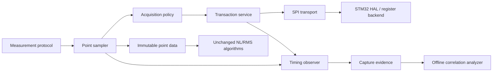

# Plan tái cấu trúc và tối ưu SPI acquisition có kiểm soát

## 1. Mục tiêu

Mục tiêu của plan là làm cho đường đọc MA600A qua SPI:

1. Có thể quan sát và truy nguyên từng nguồn gây sai khác kết quả đo.
2. Có timing xác định, cùng điều kiện lấy mẫu giữa các point và các run.
3. Cho phép tối ưu từng lớp mà không thay đổi PID, motion protocol hoặc công thức đo.
4. Chứng minh bằng dữ liệu rằng một thay đổi SPI cải thiện độ lặp lại trước khi đưa
   nó vào kết quả official.

Đích cuối không phải là “đọc nhanh nhất”, mà là **đọc đúng thời điểm, biết chất
lượng từng mẫu và phân biệt được sai lệch sensor/SPI với sai lệch motor/cơ khí**.

### 1.1 Quyết định triển khai

Baseline polling hiện tại đã đạt độ ổn định đo mong muốn. Vì vậy project chọn
**DMA-first**: triển khai ngay backend SPI1 full-duplex DMA và dùng polling hiện
tại làm chuẩn vàng để kiểm tra tương đương. Observability vẫn được thêm cùng DMA
để biết DMA có thay đổi thời điểm latch, interval hoặc kết quả hay không; nó không
còn là điều kiện phải hoàn thành trước khi viết DMA.

## 2. Các bất biến không được thay đổi

Trong các phase quan sát và tái cấu trúc:

- giữ nguyên SPI mode 3, MSB first và frame MA600A 16 bit;
- giữ nguyên PID, home, dither, approach, ramp và settle;
- target sequence hiện hành là grid 1°: 371 point capture và 360 point analysis;
- giữ nguyên 64 legacy sample/point và thứ tự phép toán legacy;
- giữ nguyên Q16 rounding, NL, RMS, harmonic, P2P và validity hiện tại;
- không đưa telemetry mới vào official gate;
- không phát UART khi motor đang enable;
- giữ nguyên prescaler SPI hiện tại trong lần chuyển DMA đầu tiên;
- không thay đổi đồng thời DMA backend, sampler timing và filtering.

Mọi thay đổi có khả năng làm khác thời điểm lấy mẫu phải có protocol ID mới và
chạy A/B với baseline trên cùng một lần lắp jig.

## 3. Hiện trạng và khoảng trống cần xử lý

Hệ thống hiện đã có:

- một checked transaction trong `ma600.c`;
- timestamp DWT và TIM1 counter ngay trước cạnh `/CS`;
- retry/unwrap theo acquisition context;
- canonical scheduled sampler;
- counter SPI failure, jump reject, skipped slot và timing overrun;
- continuous context xuyên suốt approach/sweep.

Các khoảng trống chính:

- chưa đo đầy đủ thời gian `/CS low`, thời gian HAL transaction và khoảng cách
  thực tế giữa hai transaction;
- chưa phân loại jitter do scheduler, interrupt, SPI/HAL hay retry;
- chưa có histogram pha PWM tại thời điểm sensor latch;
- chưa liên kết quality/timing của từng point với NL/RMS/residual của point đó;
- legacy back-to-back sampling có thể lấy 64 mẫu trong một cửa sổ rất ngắn, nên
  “64 mẫu” không đồng nghĩa với 64 quan sát độc lập;
- chưa có experiment contract để thay đổi từng yếu tố SPI một cách cô lập;
- chưa có tiêu chí quyết định khi nào polling, interrupt hoặc DMA phù hợp.

## 4. Kiến trúc acquisition mục tiêu



### 4.1 Quy tắc phân lớp

- `spi_transport`: chỉ thực hiện một frame và trả transport status.
- `ma600_transaction`: quản lý `/CS`, decode raw và tạo transaction metadata.
- `ma600_acquisition`: retry, jump validation và continuous unwrap.
- `ma600_point_sampler`: lịch lấy mẫu, budget và tổng hợp point.
- `acquisition_observer`: ghi evidence; không quyết định accepted/rejected.
- measurement protocol chỉ chọn policy, không gọi HAL SPI trực tiếp.
- analysis chỉ nhận immutable point series, không biết SPI backend.

## 5. Cấu trúc source đề xuất

```text
Core/Inc/acquisition/
  spi_transport.h
  ma600_transaction.h
  ma600_acquisition.h
  ma600_point_sampler.h
  acquisition_policy.h
  acquisition_observer.h

Core/Src/acquisition/
  spi_transport_hal_polling.c
  ma600_transaction.c
  ma600_acquisition.c
  ma600_point_sampler.c
  acquisition_policy.c
  acquisition_observer.c

scripts/
  analyze_acquisition_timing.ps1
  compare_acquisition_ab.ps1
  test_spi_transaction_contract.ps1
  test_acquisition_observer_contract.ps1
```

Giai đoạn đầu có thể giữ file ở thư mục phẳng để không ảnh hưởng CubeIDE. Việc
tách interface và ownership quan trọng hơn việc di chuyển vật lý ngay lập tức.

## 6. Data model cần bổ sung

### 6.1 Metadata cho một transaction

```c
typedef struct {
    uint32_t requestCycle;
    uint32_t csAssertCycle;
    uint32_t transferStartCycle;
    uint32_t transferEndCycle;
    uint32_t csDeassertCycle;
    uint16_t pwmCounterAtCs;
    uint16_t raw;
    uint8_t attemptIndex;
    uint8_t stage;
    MA600_Result_t result;
    bool metaValid;
} MA600_TransactionEvidence_t;
```

Từ record này tính được:

- software dispatch latency;
- `/CS`-to-transfer latency;
- wire/HAL transaction duration;
- `/CS low` duration;
- start-to-start interval;
- PWM phase tại latch;
- chi phí retry và vị trí retry trong point.

Các timestamp phải lấy bằng DWT, không gọi RTOS/UART trong vùng đo. Có thể bật
telemetry chi tiết bằng build flag và ghi vào ring buffer tĩnh.

### 6.2 Evidence cho một point

```c
typedef struct {
    uint32_t scheduledFirstCycle;
    uint32_t actualFirstCycle;
    uint32_t elapsedCycles;
    uint32_t intervalMinCycles;
    uint32_t intervalMaxCycles;
    uint32_t intervalMeanCycles;
    uint32_t maxAbsScheduleErrorCycles;
    uint16_t pwmPhaseMin;
    uint16_t pwmPhaseMax;
    uint16_t pwmPhaseBinMask;
    uint16_t accepted;
    uint16_t transactions;
    uint16_t retries;
    uint16_t spiFailures;
    uint16_t jumpRejects;
    uint16_t skippedSlots;
    int64_t rawMin;
    int64_t rawMax;
    int64_t rawMeanQ16;
} MA600_PointEvidence_t;
```

Point evidence phải gắn `TestID/BatchID/RunID/SweepID/PointIndex/Stage` để kết
quả offline không bị join nhầm.

## 7. Ma trận yếu tố có thể ảnh hưởng kết quả

| Nhóm | Yếu tố | Dấu hiệu cần đo | Cách cô lập |
| --- | --- | --- | --- |
| SPI transport | clock/prescaler, CPOL/CPHA, `/CS` timing, GPIO slew, timeout | failure, bit pattern bất thường, duration | logic analyzer + clock A/B |
| Firmware timing | interrupt, task switch, HAL overhead, critical section | schedule error, interval tail, overrun | idle/motor-on A/B; IRQ telemetry |
| PWM/EMI | pha TIM1 tại `/CS`, cạnh switching, motor power | raw spread theo PWM phase | phase histogram/bin comparison |
| Sampling | back-to-back hay scheduled, interval, window length | autocorrelation, effective sample count | giữ N, đổi interval một biến/lần |
| Retry/filter | max attempts, jump threshold, reject policy | retry/jump spatial clustering | fault injection + raw evidence |
| Sensor | MA600 filter config, status, magnet alignment, temperature | drift chậm, status/config change | config snapshot + thermal timeline |
| Motion | settle error, velocity còn lại, ramp history, approach | correlation với point error | cùng SPI, so settle/motion evidence |
| Mechanics | backlash, shaft/jig movement, same-direction history | run/order/direction dependence | no-remount repeated batch |
| Analysis | origin/point-0, mean window, quantization | common-mode shift hoặc point-0 leverage | offline recompute từ evidence |

Không kết luận “SPI gây sai số” chỉ từ NL/RMS thay đổi. Kết luận phải có tương
quan với timing, transport error, PWM phase hoặc raw dispersion.

## 8. Kế hoạch triển khai DMA-first theo phase

### Phase S0 — đóng băng baseline

Thực hiện:

- lưu commit SHA, binary hash, compiler optimization và clock tree;
- ghi SPI mode/prescaler và clock thực tế;
- lưu MA600 config/status snapshot;
- thu tối thiểu 3 batch × 10 run không tháo jig;
- lưu log legacy, canonical, motion, settle và acquisition hiện có;
- chốt acceptance tolerance cho numeric equality khi refactor.

Deliverable:

- baseline manifest;
- baseline raw log;
- report repeatability theo run/point;
- danh sách metric chưa quan sát được.

Gate: không bắt đầu refactor nếu chưa thể tái lập baseline bằng cùng binary.

### Phase S1 — dựng SPI1 DMA backend tối thiểu

Thực hiện:

- cấu hình SPI1 RX/TX DMA ở normal mode, byte alignment và memory increment;
- ưu tiên mapping không xung đột DMA2 Stream0 đang được ADC1 sử dụng; mapping
  cụ thể phải được CubeMX/RM0090 xác nhận trước khi sửa `.ioc`;
- thêm IRQ handler cho cả RX và TX stream và link `hspi1.hdmarx/hdmatx`;
- tạo backend `spi_transport_hal_dma.c` gọi
  `HAL_SPI_TransmitReceive_DMA()` cho đúng một frame 2 byte;
- dùng buffer transport-owned/static, không để DMA trỏ tới buffer đã hết lifetime;
- `/CS` được kéo low trước khi start DMA và chỉ kéo high tại complete/error/abort;
- callback chỉ ghi trạng thái/timestamp và completion flag; không decode, retry,
  log hoặc gọi thuật toán trong ISR;
- trial đầu dùng bounded busy-wait trên completion flag để không đưa scheduler
  jitter vào cửa sổ 64 mẫu; task notification chỉ xem xét sau khi có timing A/B;
- wrapper chờ completion có timeout hữu hạn để giữ interface tuần tự hiện tại;
- timeout phải abort DMA/SPI, clear trạng thái, deassert `/CS` và trả root cause;
- chỉ cho phép một transaction in-flight; request khi busy trả lỗi rõ ràng.

Verification:

- DMA handles/IRQ/linking đúng và không xung đột ADC/UART/I2C DMA;
- `/CS` luôn trở về high ở complete, error và timeout;
- callback không dùng API RTOS không hợp lệ với IRQ priority;
- TX buffer luôn `{0x00, 0x00}` và RX decode giữ nguyên big-endian;
- không có hai DMA transaction đồng thời.

Gate: DMA transaction độc lập phải đọc raw ổn định khi motor off trước khi nối
vào acquisition/sweep.

### Phase S2 — thay transport nhưng giữ API acquisition

Thực hiện:

- tạo cùng interface `SPI_Transport_Transfer16()` cho polling và DMA;
- chọn backend bằng compile-time policy và log `TransportBackendID`;
- `MA600_ReadRawChecked()` tiếp tục là một checked transaction đồng bộ đối với
  caller, dù bên dưới DMA và ISR hoàn thành transfer;
- giữ nguyên retry, jump validation, unwrap context và point sampler;
- không đổi call site trong PID, ramp, settle, point capture và closure;
- giữ timestamp `csAssertCycle`/`pwmCounterAtCs` sát cạnh `/CS` như baseline.

Verification:

- cùng TX bytes, CS order và raw decode;
- cùng result mapping cho OK/TIMEOUT/ERROR;
- cùng retry count, jump decision và unwrap output;
- fault injection tại từng attempt;
- command/acquisition call-order golden trace.

Gate: polling build phải byte-equivalent; DMA build phải giữ cùng raw decode,
error semantics và acquisition counter trên deterministic fixture.

### Phase S3 — thêm DMA observability và equivalence report

Thực hiện firmware và offline:

- ghi `dmaStartCycle`, `dmaCompleteCycle`, wake cycle và callback/error status;
- mở rộng transaction metadata bằng timestamp trước/sau `/CS`;
- thêm static ring buffer và stage tag;
- chỉ flush log sau `Motor_Disable()`;
- histogram transaction duration và sample interval;
- p50/p95/p99/max schedule error;
- raw spread/autocorrelation trong từng point;
- NL point error theo PWM phase bin;
- correlation giữa point error với retry, jump reject, settle error, run order,
  temperature proxy và elapsed time;
- so sánh within-run, between-run và between-batch variance;
- đánh dấu point 0 riêng vì nó ảnh hưởng toàn bộ error series.

Gate tương đương:

- DMA không làm thay đổi target/command sequence hoặc accepted point count;
- timing không tạo burst/catch-up ngoài policy hiện tại;
- observer overflow được báo rõ và không đổi official validity.

### Phase S4 — A/B polling và DMA trên hardware

Thứ tự test:

1. Polling và DMA khi motor disabled.
2. Polling và DMA khi motor holding.
3. Polling và DMA cho một engineering sweep.
4. A-B-A no-remount, cùng prescaler, cùng binary policy khác backend.
5. Tối thiểu 3 batch × 10 run cho mỗi backend trước khi promote.

Mỗi experiment phải giữ nguyên jig, nguồn, motor protocol, sample count, analysis
và thứ tự run A-B-A hoặc randomized block. Không thay hai biến trong cùng build.

Metric quyết định:

- transport failure rate;
- schedule-error p99/max;
- point raw dispersion và effective independent samples;
- RMS/NL repeatability giữa run;
- correlation với PWM phase;
- motor-active duration và CPU budget.

### Phase S5 — promote DMA vào official path

DMA được promote khi:

- raw decode và error propagation đạt contract;
- không có DMA timeout/busy/IRQ ownership bất thường;
- point count, retry/jump semantics và official validity không suy giảm;
- RMS/NL repeatability không kém baseline polling;
- safe-stop và `/CS` recovery đã qua fault injection.

Khi promote:

- DMA trở thành default transport;
- polling vẫn được giữ làm fallback engineering trong ít nhất một phase release;
- không thay SPI prescaler hoặc sample interval trong cùng changeset promote;
- protocol/log ghi rõ `SPI_DMA_BLOCKING_WRAPPER_V1`.

### Phase S6 — tích hợp và khóa contract

Thực hiện:

- version `AcquisitionProtocolID`, `TransportBackendID`, SPI clock và sampler ID;
- thêm static assert cho clock/timing budget;
- thêm parser compatibility và historical fixture;
- cập nhật manufacturing test procedure;
- xóa instrumentation transaction-level khỏi production nếu overhead không cần,
  nhưng giữ summary counter và khả năng bật engineering build.

## 9. Plan test chi tiết

### 9.1 Host/unit test

- TX/RX byte order và raw decode.
- DWT wraparound cho mọi duration calculation.
- `/CS` luôn deassert kể cả timeout/error.
- Retry không cập nhật unwrap state trước accepted sample.
- Observer không ảnh hưởng decision path.
- Ring-buffer full/overflow semantics.
- Scheduled sampler không catch-up burst sau missed slot.
- Point aggregation và Q16 output giữ nguyên golden vector.

### 9.2 Firmware contract test

- không có UART trong motor-active path;
- chỉ engine task sở hữu SPI khi busy;
- mọi point/stage có identity chính xác;
- transport root cause không bị đổi thành `OK`;
- protocol/config field hiện diện trong META;
- worst-case line/buffer length không vượt giới hạn.

### 9.3 Bench test

- logic analyzer trên SCK, MOSI, MISO, `/CS`, PWM sync pin tùy chọn;
- đo clock, duty, CS setup/hold và inter-frame gap;
- 10 run no-remount cho mỗi arm;
- A-B-A để phát hiện drift theo thời gian;
- test motor-off, holding và moving;
- test nguồn/nhiệt độ chỉ sau khi đường SPI timing đã được đặc trưng.

## 10. Acceptance criteria

Tối ưu SPI chỉ được chấp nhận khi:

1. Không thay đổi PID, motion sequence và công thức official.
2. Không tăng SPI failure, jump reject hoặc invalid point.
3. Timing p99 và worst-case nằm trong budget đã chốt.
4. Có thể truy nguyên mọi point bất thường về capture evidence.
5. Biết được variance thuộc transport/timing, PWM/EMI, motion hay mechanics với
   bằng chứng định lượng; trường hợp chưa phân biệt được phải ghi `UNRESOLVED`.
6. Repeatability RMS/NL không suy giảm; cải thiện phải lặp lại qua ít nhất ba batch.
7. Historical schema vẫn parse được và protocol mới có ID riêng.
8. Safe-stop, motor-off-before-log và resource ownership không thay đổi.

## 11. Thứ tự triển khai đã chốt

Ưu tiên thực tế:

1. S0 dùng polling hiện tại làm baseline vàng.
2. S1 cấu hình và chạy một frame SPI1 DMA độc lập.
3. S2 đặt DMA sau interface tuần tự hiện tại, chưa đổi acquisition algorithm.
4. S3 thêm evidence DMA và report tương đương.
5. S4 chạy A/B polling–DMA trên hardware.
6. S5 promote DMA, giữ polling fallback.
7. S6 khóa contract và production configuration.

Quyết định DMA đã được đưa lên đầu plan. Việc phân tích yếu tố ảnh hưởng vẫn giữ
lại để xác nhận DMA không làm mất độ ổn định mà code polling hiện tại đã đạt được.
