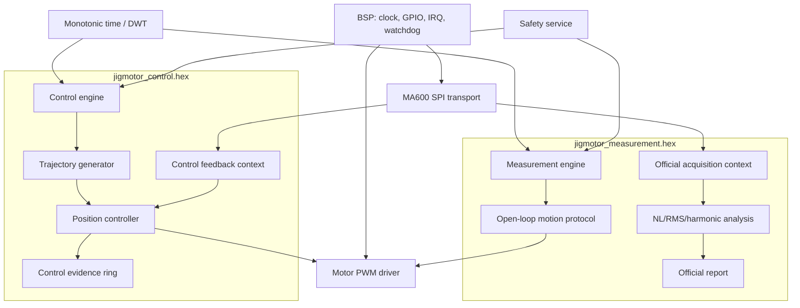
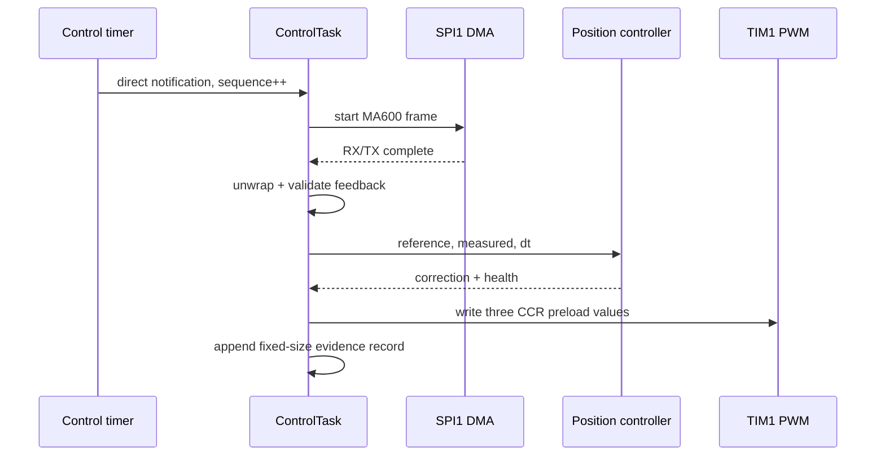

# Thiết kế hệ thống dual-image tối ưu STM32F405

Tài liệu này định nghĩa kiến trúc đích cho việc tách hoàn toàn hai nhiệm vụ:

1. `MOTOR_CONTROL`: điều khiển motor tới đúng vị trí bằng feedback MA600A.
2. `MEASUREMENT`: đo đặc tính motor bằng protocol open-loop đã đóng băng.

Mục tiêu “khai thác tối đa MCU” ở đây nghĩa là dùng đúng CPU, FPU, timer, DMA,
bus và các vùng RAM để đạt timing xác định và có headroom an toàn; không phải bật
mọi peripheral hoặc tăng tần số một cách không kiểm chứng.

## 1. Nguồn sự thật và giới hạn phần cứng

Target hiện tại là `STM32F405RGTx`, LQFP64:

- Cortex-M4F tối đa 168 MHz, có single-precision FPU và DSP instruction.
- 1 MB Flash.
- 128 KB SRAM trên system bus, gồm SRAM1 112 KB và SRAM2 16 KB.
- 64 KB CCM data RAM nối trực tiếp core; DMA không truy cập CCM.
- Hai DMA controller, tổng cộng 16 stream.
- Timer APB2 có clock 168 MHz; timer APB1 có clock 84 MHz trong clock tree hiện
  tại.

Nguồn chính thức:

- [STM32F405RG product page](https://www.st.com/en/microcontrollers-microprocessors/stm32f405rg.html)
- [RM0090 reference manual](https://www.st.com/resource/en/reference_manual/dm00031020.pdf)
- [AN4031 — STM32F2/F4/F7 DMA](https://www.st.com/resource/en/application_note/an4031-using-the-stm32f2-stm32f4-and-stm32f7-series-dma-controller-stmicroelectronics.pdf)
- [ES0182 device errata](https://www.st.com/resource/en/errata_sheet/es0182-stm32f405407xx-and-stm32f415417xx-device-errata-stmicroelectronics.pdf)

Mỗi hardware qualification phải log `DBGMCU_IDCODE.REV_ID` và đối chiếu ES0182;
không giả định mọi revision silicon có cùng limitation.

## 2. Audit firmware hiện tại

### 2.1 Clock và peripheral

| Tài nguyên | Cấu hình hiện tại | Vai trò |
| --- | --- | --- |
| CPU/HCLK | 168 MHz | control, analysis, RTOS |
| APB1 | 42 MHz, timer 84 MHz | TIM2, TIM14, UART/I2C |
| APB2 | 84 MHz, timer 168 MHz | TIM1, TIM8, SPI1, ADC1 |
| TIM1 | period 2154, prescaler 0 | PWM ba pha khoảng 77.96 kHz |
| SPI1 | mode 3, 5.25 Mbit/s | MA600A, DMA full duplex |
| USART2/3 | 921600 baud | giao tiếp/log |
| RTOS tick | 1 kHz | scheduling chung, không làm control clock |
| TIM14 | HAL timebase | `HAL_GetTick()` |
| TIM2 | input capture 32-bit | tín hiệu ngoài hiện có |
| ADC1 | 2 channel, DMA circular | analog monitoring hiện có |

### 2.2 DMA map hiện tại

| Peripheral | DMA | Ưu tiên hiện tại |
| --- | --- | --- |
| ADC1 | DMA2 Stream0 | Low |
| SPI1 RX | DMA2 Stream2 Channel3 | High |
| SPI1 TX | DMA2 Stream3 Channel3 | High |
| USART3 RX/TX | DMA1 Stream1/3 | Low |
| USART2 RX/TX | DMA1 Stream5/6 | Low |
| I2C2 TX | DMA1 Stream7 | Low |

Không được đặt SPI/UART/ADC DMA buffer trong CCM. DMA buffer phải có section và
linker assertion rõ ràng để lỗi placement bị phát hiện khi link, không chờ tới
hardware test.

### 2.3 Memory footprint Release hiện tại

Kết quả `arm-none-eabi-size -A Release/jigmotor.elf`:

| Vùng | Đang dùng | Tổng | Nhận xét |
| --- | ---: | ---: | --- |
| Flash runtime | khoảng 77.8 KB | 1024 KB | còn rất nhiều headroom |
| Main SRAM `.data+.bss+heap/stack reserve` | khoảng 126.0 KB | 128 KB | gần đầy, rủi ro cao |
| CCM | 13,024 B | 64 KB | chưa khai thác tốt |

Các allocation lớn:

- FreeRTOS `ucHeap`: 102,400 B.
- `nlCaptures`: 10,192 B.
- `nlShadowPointStorage` trong CCM: 13,024 B.
- TestTask 8192 B, DefaultTask 4096 B, TimerTask 4096 B và IdleTask 2048 B được
  lấy từ FreeRTOS heap.

Kết luận: trước khi thêm control telemetry hoặc task mới, phải chia build và
giảm/định lượng heap. Không được tiếp tục thêm global buffer vào SRAM chính.

## 3. Quyết định kiến trúc bắt buộc

### 3.1 Hai image, không phải hai nhánh runtime trong cùng test

Build tạo hai artifact:

```text
jigmotor_control.hex
jigmotor_measurement.hex
```

Mỗi image chỉ link engine của mode tương ứng. Compile guard phải báo lỗi nếu bật
zero hoặc nhiều hơn một application mode.

```c
#define JIG_APP_CONTROL      1
#define JIG_APP_MEASUREMENT  2

#ifndef JIG_APP_MODE
#error "JIG_APP_MODE must be supplied by the build profile"
#endif
```

Không cho phép đổi mode bằng button trong cùng boot. Cách này bảo đảm:

- controller state không rò sang measurement;
- correction/LUT không vô tình được dùng trong official data;
- image hash xác định chính xác thuật toán đang chạy;
- linker loại bỏ code và buffer của mode còn lại.

### 3.2 Chia sẻ driver, không chia sẻ policy/state



Phần được phép dùng chung:

- clock/GPIO/NVIC startup;
- PWM low-level driver;
- MA600 raw transaction và status/config read;
- DWT/timer utilities;
- motor-disable safety primitive;
- immutable motor geometry.

Phần cấm dùng chung:

- acquisition context và unwrap history;
- PID/controller state;
- motion profile state;
- capture buffers;
- counters và validity;
- log/result structure;
- mode-specific task/event queue.

## 4. Kiến trúc `MOTOR_CONTROL`

### 4.1 Data flow 1 kHz



Control rate ban đầu là 1 kHz. Không dùng `osDelay(1)` làm nguồn clock vì tick
jitter và thời gian thực thi sẽ trôi. Dùng một hardware timer còn trống sau audit
pin/peripheral cuối cùng; ưu tiên TIM5 32-bit nếu không có xung đột board.

SPI frame 16 bit tại 5.25 Mbit/s chỉ chiếm khoảng 3.05 us wire time, nên budget
1 ms đủ lớn. Tuy nhiên budget được kiểm chứng bằng DWT, không suy luận từ wire
time.

### 4.2 Controller topology

Controller sweep mới không tái sử dụng trực tiếp accumulator-style home
controller. Dùng cấu trúc feedforward cộng correction:

```text
reference mechanical raw
    -> exact electrical feedforward command
    + bounded position correction
    -> PWM commutation command
```

Policy tối thiểu:

- continuous unwrapped mechanical reference và feedback;
- derivative trên measurement hoặc filtered error để tránh derivative kick;
- clamped integral và conditional integration khi output saturation;
- correction clamp;
- correction slew/acceleration clamp;
- stale-feedback timeout;
- maximum consecutive deadline miss;
- target settle window độc lập với measurement settle contract.

Mỗi gain/profile phải có ID bất biến trong log. Không tuning nhiều hơn một nhóm
tham số trong một hardware image.

### 4.3 PWM path

TIM1 tiếp tục tự chạy PWM khoảng 77.96 kHz; CPU chỉ cập nhật phase/power ở control
rate. Ba CCR phải dùng preload và có hiệu lực đồng thời tại update event.

Không thay PWM frequency cùng lúc với PID tuning. Nếu sau này thay `sinf()` bằng
LUT để giảm latency:

- LUT là `const` trong Flash hoặc CPU-only CCM;
- so sánh duty output bit-for-bit hoặc theo tolerance đã chốt;
- waveform change dùng profile/version mới;
- A/B trên cùng motor trước khi đưa vào control baseline.

### 4.4 Control evidence

Không phát UART khi motor enable. ControlTask ghi record fixed-size vào ring
buffer tĩnh:

```c
typedef struct {
    uint32_t tickSequence;
    uint32_t startCycle;
    uint32_t endCycle;
    int64_t referenceRawQ16;
    int64_t measuredRawQ16;
    int32_t errorRawQ16;
    int32_t correctionRawQ16;
    uint16_t electricalCommandRaw;
    uint16_t pwmCounterAtSample;
    uint16_t flags;
} ControlEvidence_t;
```

Sau `Motor_Disable()`, ReporterTask mới chuyển record sang UART DMA hoặc text.
Ring overflow là test failure, không được âm thầm ghi đè.

## 5. Kiến trúc `MEASUREMENT`

Measurement image giữ contract:

- 371 captured point 0..370°;
- 360 analysis point 0..359;
- closure point 360;
- exact rounded 182/183 raw target;
- 64 accepted samples/point;
- official capture open-loop sau settle;
- không controller correction trong sweep/capture.

Measurement engine có compile/link guard không phụ thuộc header control. PWM
write chỉ được phép qua `MeasurementMotionPort`; mọi control API không tồn tại
trong link map của image này.

Phân tích NL/RMS/harmonic chạy sau `Motor_Disable()`. Vì vậy có thể dùng FPU/DSP
và phần lớn CPU mà không ảnh hưởng sampling deadline, nhưng mọi tối ưu CMSIS-DSP
phải chứng minh numeric equivalence trước khi thay official implementation.

## 6. Phân vùng memory mục tiêu

Linker script tách rõ:

```text
FLASH   0x08000000  1024 KB
CCMRAM  0x10000000    64 KB   CPU-only
SRAM1   0x20000000   112 KB   CPU + DMA
SRAM2   0x2001C000    16 KB   CPU + DMA, dedicated DMA/event buffers
```

Section policy:

| Section | Vùng | Nội dung |
| --- | --- | --- |
| `.data/.bss` | SRAM1 | state chung, RTOS objects |
| `.dma_sram` | SRAM2 | SPI/UART/ADC DMA buffers |
| `.control_evidence` | SRAM1 hoặc SRAM2 | ring buffer không chồng DMA |
| `.ccm_control` | CCM | controller scratch, CPU-only state |
| `.ccm_analysis` | CCM | sort/harmonic/shadow scratch |
| `.rodata` | Flash | config, LUT bất biến, strings |

Linker assertion bắt buộc:

- `.dma_sram` không vượt SRAM2;
- CCM không vượt 64 KB;
- mỗi build còn ít nhất 20% headroom SRAM1+SRAM2;
- stack/heap budget không dựa vào phần RAM “còn tình cờ”.

Budget mục tiêu ban đầu:

| Image | SRAM1 | SRAM2 | CCM | FreeRTOS heap |
| --- | ---: | ---: | ---: | ---: |
| Control | ≤64 KB | ≤12 KB | ≤32 KB | 24–32 KB |
| Measurement | ≤88 KB | ≤12 KB | ≤48 KB | 32–48 KB |

Giảm heap chỉ sau khi log được minimum-ever-free heap và stack high-water qua
hardware run. Đích là static allocation cho task/queue quan trọng; dynamic heap
chỉ dành cho startup object creation, không allocate/free trong active run.

## 7. RTOS và interrupt ownership

### 7.1 Control image

| Thành phần | Mức | Quy tắc |
| --- | --- | --- |
| Hardware emergency/fault ISR | NVIC 4 | disable motor, không gọi RTOS |
| Control timer ISR | NVIC 5 | direct task notification duy nhất |
| SPI1 DMA RX/TX IRQ | NVIC 5 | complete transaction, notify task |
| ControlTask | cao nhất trong task | không UART, không malloc, bounded work |
| UI/CommandTask | Normal | không truy cập PWM/SPI khi control owns resource |
| ReporterTask | Low | chỉ chạy/flush khi motor disabled |
| UART/ADC DMA IRQ | NVIC 7 hoặc thấp hơn | không được làm trễ control path |

### 7.2 Measurement image

- MeasurementTask sở hữu motor và SPI trong active run.
- Default/UI task chỉ gửi command vào queue.
- Reporting chạy motor-off.
- Không có ControlTask hoặc controller timer trong binary.

Mọi ISR gọi FreeRTOS API phải có numeric priority >=
`configLIBRARY_MAX_SYSCALL_INTERRUPT_PRIORITY` hiện là 5. ISR priority 0..4
không được gọi RTOS API.

## 8. Tận dụng CPU/FPU/DSP đúng cách

- Real-time path dùng `float`, fixed-point hoặc integer; tránh `double`.
- Không dùng `printf`, heap allocation, trig hoặc division không bounded trong
  ControlTask nếu chưa đo cycle budget.
- DWT CYCCNT đo duration/jitter cho từng stage.
- Bật/verify FPU theo Cortex-M4F port và kiểm tra FP context switching bằng test
  hai task; không chỉ dựa vào compiler `-mfloat-abi=hard`.
- ART/prefetch và Flash latency phải đúng clock 168 MHz.
- CMSIS-DSP chỉ dùng khi đem lại lợi ích đã đo và không làm đổi measurement math.
- Không chuyển code vào CCM; CCM của STM32F405 là data RAM CPU-only trong thiết
  kế này.

## 9. Safety và fault containment

Mọi mode dùng chung một safety contract:

- motor enable mặc định off sau reset;
- stack overflow, malloc failure, HardFault và watchdog reset đều đưa
  `MOTOR_ENA` về off sớm nhất có thể;
- sensor stale/timeout, repeated SPI error, controller deadline miss, correction
  saturation kéo dài hoặc impossible angle jump gây safe stop;
- fault snapshot lưu mode/profile/reason/sequence/cycle counter;
- IWDG chỉ được enable sau khi startup self-test hoàn thành;
- chỉ health supervisor được refresh watchdog;
- không tự restart motor sau fault; cần operator action mới.

ADC1 hiện có hai channel DMA circular nhưng ý nghĩa board signal phải được xác
nhận từ schematic trước khi dùng làm current/voltage protection. Không gán tên
“current” hoặc đặt threshold khi chưa xác nhận hardware scaling.

## 10. Performance contract

### Control image

- 1 kHz loop, zero missed deadline trong qualification run.
- control start jitter: target p99 ≤5 us, worst ≤20 us.
- execution time: target p99 ≤200 us, worst ≤500 us.
- SPI timeout/error = 0 trong valid run.
- tracking gate giai đoạn đầu: RMS ≤0.25°, max ≤0.5°.
- target sau tuning: RMS ≤0.1°, max ≤0.2°, nếu sensor/mechanics cho phép.
- evidence ring overflow = 0.

### Measurement image

- numeric contract hiện tại giữ nguyên.
- 371 captured, 360 analysis, 23,744 accepted samples/run.
- acquisition/timing failure = 0.
- control symbols/state không tồn tại trong link map.
- motor-off analysis không được làm thay đổi capture data.

### Resource gate cho cả hai

- ≥20% SRAM headroom theo linker map.
- stack high-water còn ≥25% hoặc ≥512 B, lấy mức lớn hơn.
- minimum-ever-free heap ≥25% heap configured.
- CPU/deadline metrics được log bằng integer fixed record, không đo bằng UART
  timestamp.

## 11. Những tối ưu không làm ngay

- Không tăng control rate lên 2/5/10 kHz trước khi 1 kHz có timing/plant data.
- Không đổi PWM frequency trong cùng firmware tuning PID.
- Không dùng DMA để che một state machine sai.
- Không thêm closed-loop correction vào official measurement.
- Không dùng lookup correction học từ control mode trong measurement image.
- Không refactor toàn bộ `nonlinear_test.c` và đổi thuật toán cùng một commit.

Thiết kế ưu tiên determinism, isolation và evidence. Chỉ tối ưu phần đã được
profile chứng minh là bottleneck.
