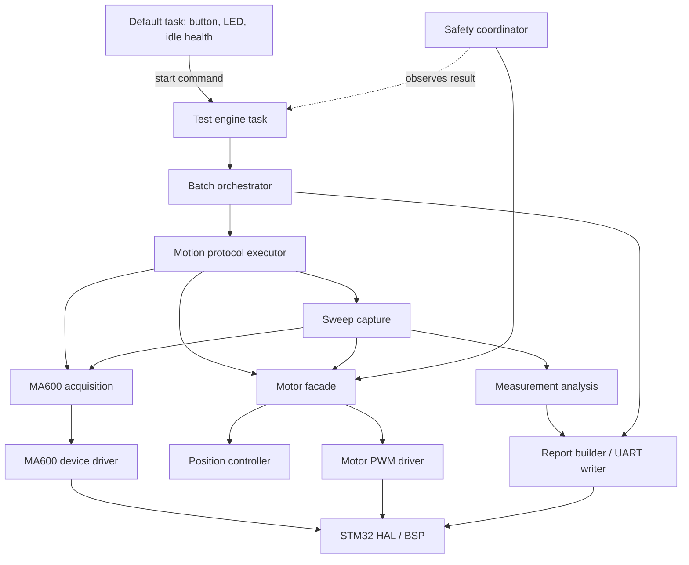
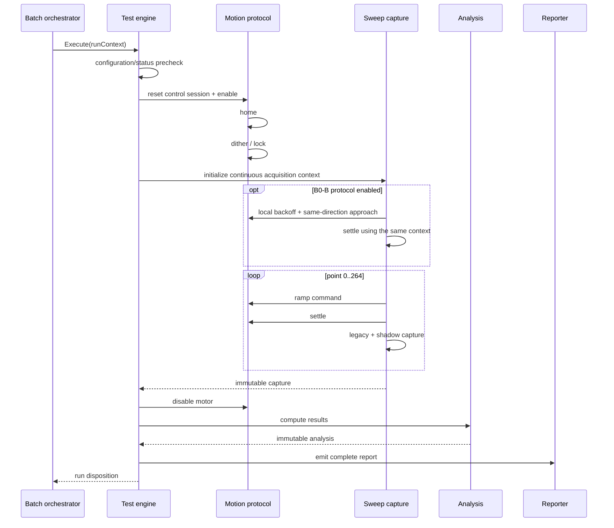
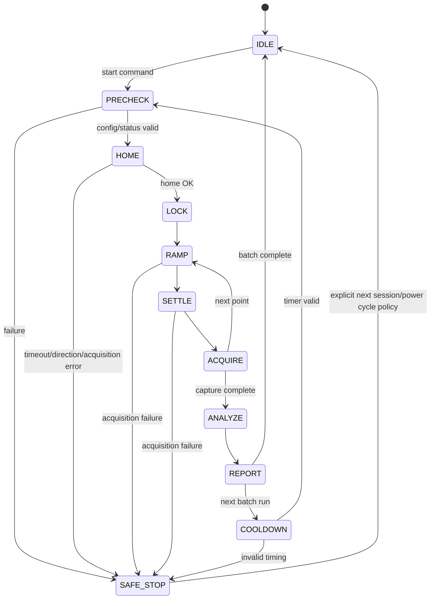

# Thiết kế hệ thống firmware V2 — tái cấu trúc nhưng giữ nguyên thuật toán

> Revision: theo quyết định thử nghiệm mới, measurement grid đã được đổi có
> chủ đích từ 256 điểm/vòng sang 360 điểm/vòng (1°). Các bất biến còn lại vẫn
> giữ nguyên; log nhận diện grid bằng `UNIFORM_1_DEG_ROUNDED_RAW_V1`.

## 1. Mục tiêu

Tài liệu này định nghĩa kiến trúc đích cho firmware `jigmotor` trên
STM32F405RGTx. Mục tiêu là làm hệ thống dễ hiểu, dễ audit, dễ test và dễ mở
rộng protocol đo mà **không thay đổi kết quả thuật toán hiện tại**.

Thiết kế này là một modular monolith chạy trên FreeRTOS. Nó không thêm scheduler,
không đổi phần cứng và không chuyển xử lý sang một MCU hoặc máy tính khác.

### 1.1 Phạm vi

- Khởi động, self-test và precheck.
- Điều khiển PWM ba pha và PID home.
- Đọc MA600A, retry, unwrap, timing metadata và point sampling.
- Protocol home, dither, approach, ramp, settle và sweep.
- Tính NL, tracking, harmonic, residual, shadow canonical và closure probe.
- Batch 1/3/10 run, precondition, cooldown và trạng thái engine.
- Logging schema-v5, parser và contract test.
- Safe-stop và ownership tài nguyên trong FreeRTOS.

### 1.2 Ngoài phạm vi

- Không tuning PID.
- Không đổi `NL_RAMP_STEP`, delay, settle threshold hoặc số mẫu.
- Không đổi công thức legacy, canonical, RMS, harmonic, P2P hoặc INL.
- Không đổi schema version hoặc ý nghĩa field đang tồn tại.
- Không thêm current sensing, reference encoder, DMA SPI hoặc watchdog phần cứng.
- Không thay đổi chính sách sản phẩm `WHOLE_SYSTEM_REPORT_ONLY_V1`.

## 2. Ràng buộc tương đương thuật toán

Mọi migration theo tài liệu này phải giữ nguyên các invariant sau:

| Nhóm | Invariant phải giữ |
| --- | --- |
| Motor geometry | 12 pole, 6 pole-pair và mapping electrical ripple hiện tại |
| Home | PID config, reset policy, loop delay, tolerance, consecutive count và timeout hiện tại |
| Dither | Cùng chuỗi lệnh, power và dwell trong `LockStartPosition()` |
| Ramp | Grid 1° dùng target tuyệt đối làm tròn 182/183 raw, `NL_RAMP_STEP=8`, cùng delay và thứ tự command/acquire |
| Settle | Cùng stability threshold, target tolerance, poll period, consecutive window và timeout |
| Point capture | 64 legacy samples/point; canonical sampler config giữ nguyên |
| Sweep | 371 captured point (0..370°), 360 analysis point và phần margin 361..370° |
| NL legacy | `target - (mean encoder - origin)` với cùng dấu và cùng float32 operation order |
| Shadow | Cùng Q16 rounding, point-0 reference, sign convention và closure calculation |
| Analysis | Cùng harmonic orders, phase convention, residual, dense fit, robust P2P và tracking math |
| Validity | Không đổi `MeasurementValid`, `TrackingValid`, settle validity hoặc official result source |
| Logging | UART chỉ phát sau `Motor_Disable()`; field cũ giữ nguyên tên, nghĩa và format |
| Failure | Acquisition/motor safety failure vẫn safe-stop; diagnostic không được tự nâng thành official gate |

Không được dùng việc “refactor” để thay đổi thứ tự phép toán float, vì việc đổi thứ
tự cộng hoặc cast có thể tạo khác biệt số dù công thức nhìn giống nhau.

## 3. Đánh giá kiến trúc hiện tại

### 3.1 Phần đang có ranh giới tốt

- `ma600.c`: một checked SPI transaction, register/status/config access và unwrap primitive.
- `ma600_acquisition.c`: retry, per-consumer context, counters và canonical point sampler.
- `position_controller.c`: controller math và state độc lập phần cứng.
- `motor_pwm.c`: phát lệnh PWM ba pha và giữ command state.
- `motor.c`: facade kết hợp feedback, PID và actuation.
- Dedicated nonlinear task sở hữu motor/SPI khi engine busy.
- Logging được trì hoãn tới sau khi motor tắt.

### 3.2 Điểm cần tái cấu trúc

`Core/Src/nonlinear_test.c` hiện hơn 4.500 dòng và đồng thời sở hữu:

- compile-time policy;
- engine task và command queue;
- batch/cooldown orchestration;
- home/dither/approach/ramp/settle;
- sweep capture và toàn bộ buffer;
- legacy/canonical analysis;
- closure probe;
- validity;
- UART formatting.

Điều này làm một thay đổi nhỏ ở protocol motion có thể chạm vào math hoặc log,
và làm unit test khó cô lập. Thiết kế mới tách theo trách nhiệm, không tách theo
“mỗi hàm một file”.

## 4. Kiến trúc đích



### 4.1 Quy tắc phụ thuộc

Phụ thuộc chỉ đi từ trên xuống:

```text
app/orchestration
    -> measurement protocols/capture/reporting
        -> motor + acquisition services
            -> device drivers
                -> STM32 HAL/BSP
```

- Driver không include measurement hoặc application header.
- Math không gọi HAL, RTOS, motor, SPI hoặc UART.
- Reporting chỉ đọc immutable result; không được điều khiển motor.
- Protocol không format text log.
- Default task không được truy cập motor hoặc SPI khi engine busy.

## 5. Cấu trúc source đề xuất

```text
Core/Inc/
  app/
    test_engine.h
    batch_orchestrator.h
    safety_coordinator.h
  measurement/
    nl_policy.h
    nl_types.h
    motion_protocol.h
    settle_detector.h
    sweep_capture.h
    closure_probe.h
    nonlinear_analysis.h
    shadow_analysis.h
    measurement_validity.h
    nonlinear_report.h
  services/
    motor_service.h
    encoder_service.h

Core/Src/
  app/
    test_engine.c
    batch_orchestrator.c
    safety_coordinator.c
  measurement/
    nl_policy.c
    motion_protocol.c
    settle_detector.c
    sweep_capture.c
    closure_probe.c
    nonlinear_analysis.c
    shadow_analysis.c
    measurement_validity.c
    nonlinear_report.c
  services/
    motor_service.c
    encoder_service.c

  # Giữ nguyên driver hiện có
  motor.c
  motor_pwm.c
  position_controller.c
  ma600.c
  ma600_acquisition.c
```

Trong migration đầu tiên có thể giữ file ở `Core/Src` phẳng để tránh sửa CubeIDE
path. Ranh giới module và public header quan trọng hơn vị trí thư mục vật lý.

## 6. Thiết kế component

### 6.1 `test_engine`

Trách nhiệm:

- Tạo one-entry command queue và dedicated task.
- Công bố `IDLE/PRECHECK/HOME/.../SAFE_STOP`.
- Nhận start request không blocking.
- Trao quyền điều khiển tài nguyên cho một test session.
- Không chứa thuật toán đo.

Public API giữ tương thích:

```c
bool NonlinearEngine_Init(void);
bool NonlinearEngine_RequestStart(void);
bool NonlinearEngine_IsBusy(void);
NonlinearEngineState_t NonlinearEngine_GetState(void);
```

### 6.2 `batch_orchestrator`

Trách nhiệm:

- Precondition và official run count.
- Cooldown target/tolerance.
- BatchID, CycleOrder, RunOrder và RunRole.
- Dừng batch khi run trả failure theo policy hiện tại.
- Tạo immutable `NlRunContext` cho mỗi run.

Không được gọi trực tiếp `Motor_SetElectricalPos()` hoặc `MA600_AcquireSample()`.

```c
typedef struct {
    uint32_t batchId;
    uint32_t cycleOrder;
    uint32_t runOrder;
    uint32_t batchRunCount;
    bool preconditionRun;
    bool eligibleForStatistics;
    uint32_t cooldownTargetMs;
    uint32_t cooldownActualMs;
} NlRunContext;
```

### 6.3 `motion_protocol`

Đây là owner của thứ tự motion, không phải owner của feature math.

Trách nhiệm:

- Home bằng `Motor_MoveToAngle()` và policy reset hiện tại.
- Dither/lock.
- Optional B0-B approach.
- Ramp helper và exact command step count.
- Gọi settle detector với cùng acquisition context.
- Phát event trạng thái cho engine.

Interface:

```c
typedef struct {
    MA600_AcquisitionContext_t *acquisition;
    NlAcquisitionCounters_t *rampCounters;
    NlAcquisitionCounters_t *settleCounters;
} NlMotionSession;

MA600_Result_t NlMotion_RampCommandToTarget(
    NlMotionSession *session,
    int32_t *commandPos,
    int32_t targetPos,
    uint32_t *stepsExecuted);

NlSettleResult_t NlMotion_WaitForSettle(
    NlMotionSession *session,
    int64_t expectedTargetUnwrapped,
    bool targetRequired,
    NlSettleObservation_t *out);
```

`commandPos` và `unwrappedRaw` phải tiếp tục là hai miền tọa độ riêng biệt.
Kiểu dữ liệu và tên field phải thể hiện miền:

- `*CommandRaw`: lệnh motor.
- `*EncoderRaw`: raw 16-bit MA600A.
- `*UnwrappedRaw`: encoder int64 liên tục.
- `*Q16`: fixed-point canonical.
- `*Deg`: degree float.

### 6.4 `settle_detector`

Trách nhiệm duy nhất là thực hiện thuật toán settle hiện tại:

- poll mỗi 1 ms;
- movement delta không quá 9 raw;
- 8 lần liên tiếp;
- target tolerance 910 raw khi required;
- timeout 100 ms;
- trả `OK/TIMEOUT/WRONG_POSITION/ACQUISITION_ERROR`.

Module không quyết định batch abort hoặc official validity. Caller mapping kết quả
theo policy hiện tại.

### 6.5 `sweep_capture`

Trách nhiệm:

- Sở hữu một continuous `MA600_AcquisitionContext_t` trong toàn sweep.
- Capture point 0, ramp, settle và capture point tiếp theo.
- Lưu legacy point arrays và shadow point metadata.
- Không tính harmonic và không phát UART.
- Trả `NlSweepCapture` đầy đủ hoặc partial capture với failure metadata.

```c
typedef struct {
    NlRunContext run;
    NlSweepDirection_t direction;
    NlSweepCaptureStatus_t status;
    MA600_Result_t acquisitionResult;
    NlMotionDiagnostics motion;
    NlPointSeries legacyPoints;
    NlShadowPointSeries shadowPoints;
} NlSweepCapture;
```

Các buffer lớn tiếp tục dùng static storage/CCM; không malloc trong run.

### 6.6 `nonlinear_analysis`

Pure deterministic module. Input là immutable point series, output là result.

Giữ nguyên:

- legacy NL sign;
- 360 analysis points trên grid danh nghĩa 1°;
- arithmetic mean và float operation order;
- harmonic order `{1,2,3,6,9,12,18,27,36,45,72,108}`;
- legacy order set `{1,2,3,6,12,18}`;
- robust top/bottom-5;
- P99, crest factor, residual, dense fitted P2P và phase mask.

```c
bool NlAnalysis_ComputeLegacy(
    const NlPointSeries *points,
    NlAnalysisResult *out);
```

Module này không biết batch, jig ID, UART hoặc motor state.

### 6.7 `shadow_analysis`

Tách canonical/Q16 khỏi legacy math nhưng giữ chạy song song:

- point mean Q16;
- point-0 reference;
- canonical error;
- shadow RMS/A36/P2P;
- closure point 360.

Kết quả vẫn `Official=0`; không ảnh hưởng legacy `MeasurementValid` hoặc `Motor OK`.

### 6.8 `closure_probe`

Giữ nguyên stage count, elapsed target, acquisition budget và timing comparability.
Module chỉ capture và tính diagnostic; policy vẫn không official.

### 6.9 `measurement_validity`

Tập trung logic validity đang phân tán nhưng không đổi tiêu chí:

```c
typedef struct {
    bool pointCountComplete;
    bool settleComplete;
    bool acquisitionClean;
    bool trackingValid;
} NlValidityInputs;

bool NlValidity_ComputeMeasurementValid(const NlValidityInputs *in);
```

Approach/closure diagnostic eligibility phải là field riêng, không được âm thầm
gộp vào official validity nếu policy hiện tại chưa cho phép.

### 6.10 `nonlinear_report`

Trách nhiệm:

- Format META/DATA/ACQ/MOTION/RESULT/SHADOW/CLOSURE/APPROACH/END.
- Giữ identity field nhất quán.
- Format `int64_t` bằng helper hiện tại, không dựa vào long-long printf.
- Phát UART sau khi motor đã disable.
- Phát record invalid với NA/attempted semantics chính xác.

Reporter nhận immutable `NlRunReport` và không gọi acquisition hoặc motion.

## 7. Runtime và ownership

### 7.1 Task model

| Task | Trách nhiệm | Được dùng SPI1 | Được điều khiển motor | Được phát log dài |
| --- | --- | ---: | ---: | ---: |
| Default task | button, heartbeat, idle health | Chỉ khi engine idle | Không | Chỉ fault ngắn |
| Test engine task | toàn bộ run/batch | Có, exclusive khi busy | Có, exclusive | Sau motor-off |

Không thêm mutex cho SPI/motor trong phase đầu. Ownership theo engine busy là
đơn giản và deterministic hơn. Nếu sau này có task thứ ba cần SPI thì phải thêm
resource arbiter, không được chỉ thêm mutex rời rạc quanh từng transaction.

### 7.2 Trình tự một run



Yêu cầu tuyệt đối: không UART trong đoạn từ `Motor_Enable()` đến
`Motor_Disable()`, trừ fatal/safety path đã version rõ.

### 7.3 State machine



## 8. Error model

### 8.1 Phân lớp lỗi

| Lớp | Ví dụ | Kiểu trả về | Policy |
| --- | --- | --- | --- |
| Device/acquisition | SPI timeout, jump reject exhausted | `MA600_Result_t` | Stop motion, disable motor, batch fail |
| Motion execution | home timeout, wrong direction | `NlMotionResult_t` | Safe-stop |
| Settle protocol | timeout, wrong position | `NlSettleResult_t` | Mark invalid theo policy hiện tại |
| Analysis | insufficient points, overflow | `NlAnalysisStatus_t` | Không tạo valid result |
| Diagnostic | closure/approach not qualified | Diagnostic status | Không đổi official result |
| Infrastructure | stack overflow, malloc failure | fatal hook | Motor enable low + fatal handler |

Không được map acquisition error thành `OK` chỉ vì nó xuất hiện bên trong settle
hoặc approach. Mỗi layer giữ nguyên nguyên nhân gốc và caller quyết định policy.

### 8.2 Safe output

- `MOTOR_ENA` mặc định low trong GPIO init.
- `Motor_Disable()` phải chạy trước report hoặc khi thoát motion path.
- Stack overflow/malloc failure kéo enable low trước `Error_Handler()`.
- Partial capture phải giữ underlying acquisition result và attempted-stage state.

## 9. Data model và lifecycle

### 9.1 Ba loại dữ liệu

1. **Session context**: ID, protocol, build, jig, batch/run role.
2. **Capture evidence**: raw point, timing, counters, settle, ramp và partial failure.
3. **Derived analysis**: NL, harmonics, tracking, shadow và closure.

Derived analysis không được ghi đè capture evidence. Reporter có thể phát cả hai,
nhưng capture là nguồn audit để tính lại offline.

### 9.2 Lifecycle

```text
zero-init storage
  -> initialize identity and NOT_ATTEMPTED states
  -> capture mutates only owned slot
  -> motor disable
  -> capture becomes immutable
  -> analysis fills separate result object
  -> reporter reads both
  -> slot reused only at next explicit run boundary
```

Không dùng zero của enum để ngụ ý stage đã chạy thành công. Mọi optional stage phải
có `attempted/started/complete` hoặc `NA` rõ ràng.

## 10. Timing và deterministic behavior

- DWT timestamp tiếp tục lấy sát `/CS` trong low-level driver.
- `HAL_GetTick()` chỉ dùng cho timeout/dwell millisecond.
- Canonical scheduled sampling tiếp tục dùng DWT cycle.
- Không thêm printf, allocation hoặc file abstraction vào motor-active path.
- Refactor ramp/settle phải được trace bằng command sequence và counter equality.
- UART buffer size phải có worst-case formatted-length test.
- Mọi module mới phải giữ bounded loop và acquisition budget hiện tại.

## 11. Configuration và protocol versioning

Compile flag hiện tại được gom về `nl_policy.h`, nhưng giá trị không đổi:

- batch mode;
- closure probe;
- B0-B approach;
- ramp diagnostic/soft-start;
- CCW engineering;
- fault injection/self-test.

Mỗi tổ hợp hành vi phải có protocol ID trong log. Compile-time guard tiếp tục cấm
tổ hợp chưa được validation, ví dụ equal-CW approach với CCW engineering nếu chưa
có protocol đối xứng.

Không nên truyền hàng chục macro qua mọi module. `nl_policy.c` tạo một immutable
configuration object từ các macro:

```c
typedef struct {
    NlSweepConfig sweep;
    NlSettleConfig settle;
    NlBatchConfig batch;
    NlDiagnosticConfig diagnostics;
    NlProtocolIds ids;
} NlSystemPolicy;

const NlSystemPolicy *NlPolicy_Get(void);
```

Giá trị object phải được compile-time/static assert đối chiếu với macro legacy
trong giai đoạn migration.

## 12. Logging và offline tools

### 12.1 Contract firmware

- Mỗi record có identity đủ để join khi log bị cắt.
- META/RESULT/END giữ field cũ.
- Diagnostic chi tiết ở record riêng để tránh tràn `LogLineLarge()`.
- Invalid/partial stage dùng `NA`, không dùng zero giả.
- `MeasurementValid` và diagnostic eligibility là hai khái niệm khác nhau.

### 12.2 Contract parser

`scripts/analyze_nonlinear_logs.ps1` là parser/validator chuẩn. Nó phải:

- hỗ trợ historical schema;
- kiểm tra identity giữa record;
- kiểm tra uniqueness và completeness;
- không đưa precondition/invalid diagnostic vào thống kê mặc định;
- xuất raw capture validity và official eligibility riêng.

Plot tool không được tự xem mọi RESULT là eligible. Nó phải nhận dữ liệu đã validate
từ analyzer hoặc thực hiện cùng validity filter.

## 13. Chiến lược migration không đổi thuật toán

### Phase 0 — đóng băng baseline

- Lưu SHA/build artifact và log A/B đại diện.
- Chạy toàn bộ contract test hiện tại.
- Lưu compiler stack-usage và memory map.
- Chốt hash của field order/schema fixture.

### Phase 1 — tách pure math

- Di chuyển helper harmonic/stats/model sang `nonlinear_analysis.c`.
- Không đổi signature nội bộ, operation order hoặc buffer.
- Golden-vector test byte/float tolerance trước và sau.

### Phase 2 — tách reporter

- Di chuyển formatting/PrintSweepLog sang `nonlinear_report.c`.
- Capture vẫn ở file cũ.
- So sánh record contract và worst-case line length.

### Phase 3 — tách motion/settle

- Di chuyển ramp, settle, home/dither protocol.
- Trace command, delay, acquisition-call order và counters.
- Không chạy thay đổi algorithm trong cùng commit.

### Phase 4 — tách capture

- Chuyển point loop và storage ownership.
- Giữ continuous acquisition context và static memory.
- So sánh DATA/ACQ/MOTION structure trên hardware.

### Phase 5 — tách batch/engine

- Di chuyển batch state và cooldown khỏi measurement module.
- Giữ public API trong `nonlinear_test.h` bằng compatibility facade tới khi hoàn tất.

### Phase 6 — xóa facade cũ

- Chỉ thực hiện sau khi Debug/Release, host test và hardware A/B equivalence đều đạt.
- Cập nhật tài liệu ownership và dependency.

Mỗi phase là một behavioral no-op riêng. Không trộn migration với tuning hoặc protocol
mới trong cùng changeset.

## 14. Verification matrix

| Hạng mục | Kiểm tra bắt buộc |
| --- | --- |
| Build | Debug + Release, zero error/warning |
| Static contracts | Toàn bộ `scripts/test_*.ps1` |
| Legacy math | Golden input cho NL/stats/harmonic; cùng kết quả trong tolerance đóng băng |
| Command trace | Cùng chuỗi PWM command, step count và delay order |
| Acquisition | Cùng accepted/retry/jump/failure counters |
| Settle | Cùng result, poll count và final sample với deterministic fixture |
| Capture | Cùng point count, target sequence và record order |
| Logging | Identity, NA semantics, no truncation, historical parser compatibility |
| Failure injection | SPI timeout ở home/ramp/settle/point capture đều giữ nguyên root cause |
| RTOS | Queue busy behavior, resource ownership, stack high-water |
| Hardware | A-before/A-after no-remount comparison; không dùng exact equality cho physical metric |

## 15. Acceptance criteria cho kiến trúc mới

Kiến trúc mới chỉ được coi là hoàn tất khi:

1. `nonlinear_test.c` chỉ còn compatibility facade hoặc bị xóa có chủ đích.
2. Không có vòng motion nào gọi reporter/UART.
3. Pure analysis build/test được không cần HAL.
4. Mọi acquisition failure giữ nguyên root cause tới batch disposition.
5. Motor và SPI có một owner rõ ràng tại mọi thời điểm.
6. Buffer lớn không malloc và có owner/lifecycle được tài liệu hóa.
7. Schema-v5 historical fixture vẫn parse được.
8. Tất cả protocol/algorithm invariant ở mục 2 được trace tới test.
9. Hardware log xác nhận point count, command sequence, counters và repeatability không suy giảm.

## 16. Quyết định thiết kế chính

- Chọn modular monolith thay vì service/framework phức tạp.
- Giữ blocking SPI vì chưa có bằng chứng DMA cải thiện kết quả.
- Giữ hai task và ownership theo engine busy.
- Tách capture evidence khỏi derived analysis.
- Tách official validity khỏi diagnostic eligibility.
- Version protocol thay vì thay đổi ngầm bằng macro không log.
- Migration theo từng responsibility, mỗi bước là behavioral no-op.

Thiết kế này tạo ranh giới để project tiếp tục thử nghiệm motion protocol mà không
làm tăng rủi ro thay đổi nhầm math, validity hoặc log—đồng thời bảo toàn toàn bộ
thuật toán đã được kiểm chứng trong firmware hiện tại.
